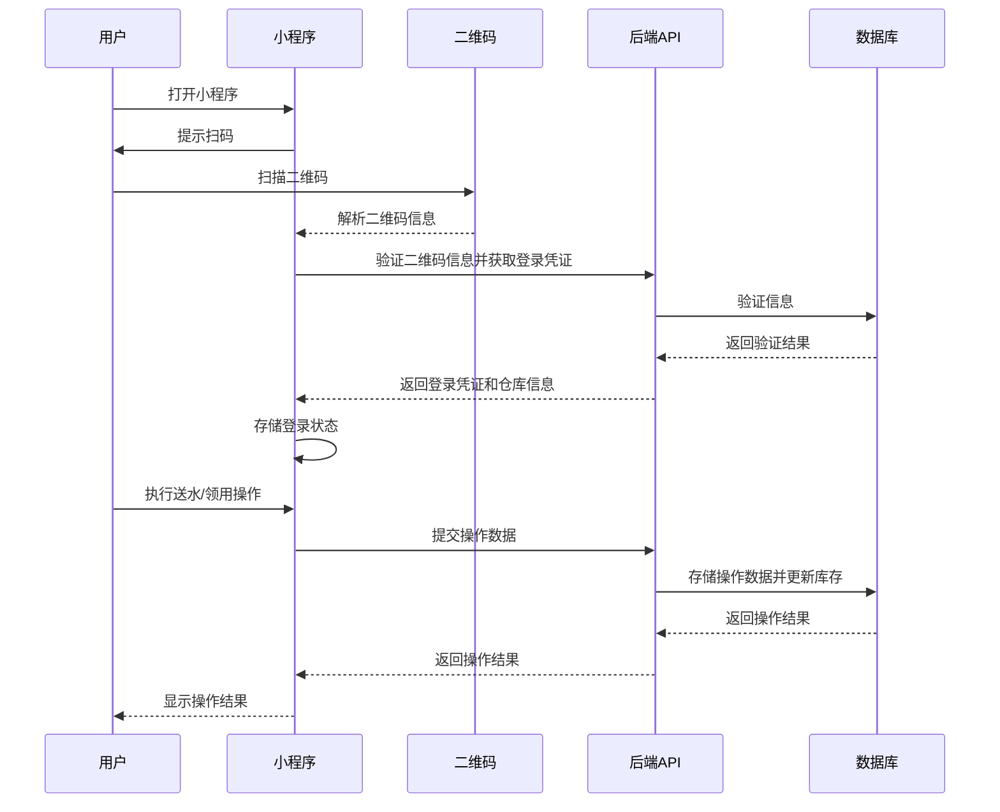

# 饮用水领用系统小程序开发文档（v1.0.0）

## 1. 系统概述

### 1.1 系统简介
饮用水领用系统小程序是基于现有桌面端系统开发的移动端应用，旨在简化送水员和领用人的操作流程。小程序通过扫描二维码实现快速登录和操作，无需传统的账号密码登录方式，提高了操作效率和用户体验。

### 1.2 系统目标
- 实现扫码快速登录，区分送水员和领用人角色
- 提供简洁的送水操作界面，减少操作步骤
- 提供便捷的领用申请界面，简化领用流程
- 确保数据与桌面端系统实时同步
- 提供良好的用户体验和操作流畅性

### 1.3 系统功能模块
- **扫码登录模块**：通过扫描二维码实现角色登录和仓库信息获取
- **送水管理模块**：处理送水记录和空桶领取
- **领用管理模块**：处理饮用水领用申请和空桶归还
- **数据同步模块**：确保与后端系统的数据实时同步

## 2. 技术栈

### 2.1 前端技术
- **微信小程序**：基于微信平台的移动端应用
- **WXML/WXSS/JS**：微信小程序开发语言
- **WeUI**：微信官方UI组件库
- **微信扫码API**：用于实现扫码登录功能

### 2.2 后端技术
- **现有后端系统**：复用现有的Node.js + Express后端
- **API接口**：使用现有的RESTful API接口
- **数据库**：复用现有的MySQL数据库

### 2.3 开发工具
- **微信开发者工具**：用于小程序开发和调试
- **Visual Studio Code**：用于代码编辑

## 3. 系统架构

### 3.1 架构概述
小程序采用前端与后端分离的架构，前端通过调用后端API接口实现数据交互。小程序通过扫描二维码获取登录信息和仓库信息，无需传统的账号密码登录方式。

### 3.2 架构图



### 3.3 目录结构

```
water-mini-app/
├── pages/
│   ├── login/
│   │   ├── index.wxml
│   │   ├── index.wxss
│   │   ├── index.js
│   │   └── index.json
│   ├── delivery/
│   │   ├── index.wxml
│   │   ├── index.wxss
│   │   ├── index.js
│   │   └── index.json
│   ├── consumption/
│   │   ├── index.wxml
│   │   ├── index.wxss
│   │   ├── index.js
│   │   └── index.json
│   └── success/
│       ├── index.wxml
│       ├── index.wxss
│       ├── index.js
│       └── index.json
├── utils/
│   ├── api.js
│   └── qrcode.js
├── app.js
├── app.json
├── app.wxss
└── project.config.json
```

## 4. 核心功能设计

### 4.1 扫码登录功能

#### 4.1.1 二维码设计
- **二维码内容**：包含角色信息（送水员/领用人）、仓库ID、时间戳、签名等信息
- **二维码格式**：JSON格式，示例：
  ```json
  {
    "role": "deliveryman",
    "warehouseId": "1",
    "timestamp": "1676908800000",
    "signature": "xxxxxxxxxxxxxxxx"
  }
  ```
- **二维码生成**：由后端系统生成，每个仓库对应不同的二维码

#### 4.1.2 登录流程
1. 用户打开小程序
2. 小程序进入扫码页面，调用微信扫码API
3. 用户扫描对应角色和仓库的二维码
4. 小程序解析二维码内容，获取角色和仓库信息
5. 小程序向后端验证二维码信息的有效性
6. 验证通过后，小程序根据角色跳转到对应的操作页面
7. 小程序存储登录状态和仓库信息

### 4.2 送水管理功能

#### 4.2.1 页面设计
- **页面名称**：送水记录
- **页面元素**：
  - 仓库信息显示（自动填充，来自二维码）
  - 送水数量输入框
  - 空桶领取数量输入框
  - 送水时间显示（默认当前时间，可修改）
  - 备注输入框
  - 提交按钮

#### 4.2.2 操作流程
1. 送水员扫描送水员角色的二维码
2. 小程序自动识别角色为送水员，并获取仓库信息
3. 跳转至送水操作页面，自动填充仓库信息
4. 送水员输入送水数量和空桶领取数量
5. 确认送水时间（默认当前时间，可修改）
6. 可选输入备注信息
7. 点击提交按钮
8. 小程序向后端提交送水记录
9. 后端更新库存信息
10. 显示操作成功提示

#### 4.2.3 数据处理
- **默认值**：
  - 饮用水品类：默认桶装水
  - 仓库：来自二维码信息
  - 送水时间：默认当前时间
- **数据验证**：
  - 送水数量：必填，大于0
  - 空桶领取数量：必填，大于等于0

### 4.3 领用管理功能

#### 4.3.1 页面设计
- **页面名称**：领用申请
- **页面元素**：
  - 仓库信息显示（自动填充，来自二维码）
  - 领用部门选择器
  - 领用人输入框
  - 领用数量输入框
  - 归还空桶数量输入框
  - 领用时间显示（默认当前时间，不可修改）
  - 备注输入框
  - 提交按钮

#### 4.3.2 操作流程
1. 领用人扫描领用人角色的二维码
2. 小程序自动识别角色为领用人，并获取仓库信息
3. 跳转至领用操作页面，自动填充仓库信息
4. 领用人选择领用部门
5. 领用人输入姓名
6. 输入领用数量和归还空桶数量
7. 确认领用时间（默认当前时间，不可修改）
8. 可选输入备注信息
9. 点击提交按钮
10. 小程序向后端提交领用申请
11. 后端更新库存信息
12. 显示操作成功提示

#### 4.3.3 数据处理
- **默认值**：
  - 饮用水品类：默认桶装水
  - 仓库：来自二维码信息
  - 领用时间：默认当前时间
- **数据验证**：
  - 领用部门：必填
  - 领用人：必填
  - 领用数量：必填，大于0，不超过库存
  - 归还空桶数量：必填，大于等于0

## 5. 后端API设计

### 5.1 扫码登录API
| API路径 | 方法 | 功能描述 | 请求体（JSON） | 成功响应（200 OK） |
| :--- | :--- | :--- | :--- | :--- |
| `/api/mini-app/login` | `POST` | 验证二维码信息并登录 | `{"role": "deliveryman", "warehouseId": "1", "timestamp": "1676908800000", "signature": "xxxxxxxxxxxxxxxx"}` | `{"code": 200, "data": {"token": "...", "role": "deliveryman", "warehouse": {...}}, "message": "登录成功"}` |

### 5.2 送水记录API
| API路径 | 方法 | 功能描述 | 请求体（JSON） | 成功响应（200 OK） |
| :--- | :--- | :--- | :--- | :--- |
| `/api/delivery` | `POST` | 添加送水记录 | `{"waterCategoryId": 1, "warehouseId": 1, "quantity": 50, "emptyBucketQuantity": 20, "date": "2026-02-01", "remark": "月度送水"}` | `{"code": 200, "data": {...}, "message": "添加成功"}` |

### 5.3 领用记录API
| API路径 | 方法 | 功能描述 | 请求体（JSON） | 成功响应（200 OK） |
| :--- | :--- | :--- | :--- | :--- |
| `/api/consumption` | `POST` | 提交领用申请 | `{"waterCategoryId": 1, "warehouseId": 1, "departmentId": 1, "receiver": "张三", "quantity": 10, "returnEmptyBottles": 5, "consumptionDate": "2026-02-02", "notes": "行政部领用"}` | `{"code": 200, "data": {...}, "message": "提交成功"}` |

### 5.4 部门列表API
| API路径 | 方法 | 功能描述 | 请求体（JSON） | 成功响应（200 OK） |
| :--- | :--- | :--- | :--- | :--- |
| `/api/consumption/department` | `GET` | 获取部门列表 | N/A | `{"code": 200, "data": [...], "message": "获取成功"}` |

## 6. 前端功能设计

### 6.1 页面设计

#### 6.1.1 扫码登录页面（login/index.wxml）
- **功能**：扫描二维码实现登录
- **元素**：
  - 页面标题："饮用水领用系统"
  - 扫码提示："请扫描对应角色的二维码"
  - 扫码按钮：点击调用微信扫码API
  - 角色说明：送水员二维码 vs 领用人二维码
- **交互**：点击扫码按钮，调用微信扫码API，解析二维码信息，验证登录

#### 6.1.2 送水管理页面（delivery/index.wxml）
- **功能**：处理送水操作
- **元素**：
  - 页面标题："送水记录"
  - 仓库信息：自动填充，来自二维码
  - 送水数量输入框：带数字键盘
  - 空桶领取数量输入框：带数字键盘
  - 送水时间：默认当前时间，可点击修改
  - 备注输入框：多行文本
  - 提交按钮：点击提交送水记录
- **交互**：输入送水数量和空桶数量，确认时间，点击提交

#### 6.1.3 领用管理页面（consumption/index.wxml）
- **功能**：处理领用操作
- **元素**：
  - 页面标题："领用申请"
  - 仓库信息：自动填充，来自二维码
  - 领用部门选择器：下拉选择
  - 领用人输入框：文本输入
  - 领用数量输入框：带数字键盘
  - 归还空桶数量输入框：带数字键盘
  - 领用时间：默认当前时间，不可修改
  - 备注输入框：多行文本
  - 提交按钮：点击提交领用申请
- **交互**：选择部门，输入领用人和数量，点击提交

#### 6.1.4 成功提示页面（success/index.wxml）
- **功能**：显示操作成功提示
- **元素**：
  - 成功图标
  - 成功提示文本："操作成功"
  - 操作详情：显示提交的信息摘要
  - 返回按钮：返回扫码页面
- **交互**：点击返回按钮，返回扫码页面

### 6.2 核心功能实现

#### 6.2.1 扫码功能实现
```javascript
// login/index.js
const api = require('../../utils/api.js');

Page({
  data: {
    scanning: false
  },
  
  // 扫码按钮点击事件
  scanCode: function() {
    if (this.data.scanning) return;
    
    this.setData({ scanning: true });
    
    wx.scanCode({
      success: (res) => {
        try {
          // 解析二维码内容
          const qrData = JSON.parse(res.result);
          
          // 验证二维码数据
          if (!qrData.role || !qrData.warehouseId) {
            wx.showToast({ title: '二维码格式错误', icon: 'none' });
            return;
          }
          
          // 调用登录API
          api.login(qrData).then(response => {
            if (response.code === 200) {
              // 存储登录状态
              wx.setStorageSync('token', response.data.token);
              wx.setStorageSync('role', qrData.role);
              wx.setStorageSync('warehouse', response.data.warehouse);
              
              // 根据角色跳转
              if (qrData.role === 'deliveryman') {
                wx.navigateTo({ url: '../delivery/index' });
              } else if (qrData.role === 'user') {
                wx.navigateTo({ url: '../consumption/index' });
              }
            } else {
              wx.showToast({ title: response.message, icon: 'none' });
            }
          }).catch(error => {
            wx.showToast({ title: '登录失败', icon: 'none' });
            console.error('登录失败:', error);
          });
        } catch (e) {
          wx.showToast({ title: '二维码解析失败', icon: 'none' });
          console.error('二维码解析失败:', e);
        }
      },
      fail: (error) => {
        wx.showToast({ title: '扫码失败', icon: 'none' });
        console.error('扫码失败:', error);
      },
      complete: () => {
        this.setData({ scanning: false });
      }
    });
  }
});
```

#### 6.2.2 送水功能实现
```javascript
// delivery/index.js
const api = require('../../utils/api.js');

Page({
  data: {
    warehouse: {},
    quantity: '',
    emptyBucketQuantity: '',
    date: new Date().toISOString().split('T')[0],
    remark: ''
  },
  
  onLoad: function() {
    // 获取仓库信息
    const warehouse = wx.getStorageSync('warehouse');
    if (warehouse) {
      this.setData({ warehouse });
    } else {
      wx.showToast({ title: '请先扫码登录', icon: 'none' });
      wx.navigateBack();
    }
  },
  
  // 输入送水数量
  bindQuantityInput: function(e) {
    this.setData({ quantity: e.detail.value });
  },
  
  // 输入空桶数量
  bindEmptyBucketInput: function(e) {
    this.setData({ emptyBucketQuantity: e.detail.value });
  },
  
  // 选择日期
  bindDateChange: function(e) {
    this.setData({ date: e.detail.value });
  },
  
  // 输入备注
  bindRemarkInput: function(e) {
    this.setData({ remark: e.detail.value });
  },
  
  // 提交送水记录
  submitDelivery: function() {
    const { warehouse, quantity, emptyBucketQuantity, date, remark } = this.data;
    
    // 验证输入
    if (!quantity || quantity <= 0) {
      wx.showToast({ title: '请输入有效的送水数量', icon: 'none' });
      return;
    }
    
    if (!emptyBucketQuantity) {
      wx.showToast({ title: '请输入空桶领取数量', icon: 'none' });
      return;
    }
    
    // 构建请求数据
    const deliveryData = {
      waterCategoryId: 1, // 默认桶装水
      warehouseId: warehouse.id,
      quantity: parseInt(quantity),
      emptyBucketQuantity: parseInt(emptyBucketQuantity),
      date: date,
      remark: remark
    };
    
    // 提交数据
    api.addDelivery(deliveryData).then(response => {
      if (response.code === 200) {
        // 跳转到成功页面
        wx.navigateTo({
          url: '../success/index',
          success: function(res) {
            res.eventChannel.emit('acceptDataFromOpenerPage', {
              operation: 'delivery',
              data: deliveryData
            });
          }
        });
      } else {
        wx.showToast({ title: response.message, icon: 'none' });
      }
    }).catch(error => {
      wx.showToast({ title: '提交失败', icon: 'none' });
      console.error('提交失败:', error);
    });
  }
});
```

#### 6.2.3 领用功能实现
```javascript
// consumption/index.js
const api = require('../../utils/api.js');

Page({
  data: {
    warehouse: {},
    departments: [],
    departmentId: '',
    receiver: '',
    quantity: '',
    returnEmptyBottles: '',
    consumptionDate: new Date().toISOString().split('T')[0],
    notes: ''
  },
  
  onLoad: function() {
    // 获取仓库信息
    const warehouse = wx.getStorageSync('warehouse');
    if (warehouse) {
      this.setData({ warehouse });
    } else {
      wx.showToast({ title: '请先扫码登录', icon: 'none' });
      wx.navigateBack();
      return;
    }
    
    // 加载部门列表
    this.loadDepartments();
  },
  
  // 加载部门列表
  loadDepartments: function() {
    api.getDepartments().then(response => {
      if (response.code === 200) {
        this.setData({ departments: response.data });
      }
    }).catch(error => {
      console.error('获取部门列表失败:', error);
    });
  },
  
  // 选择部门
  bindDepartmentChange: function(e) {
    this.setData({ departmentId: e.detail.value });
  },
  
  // 输入领用人
  bindReceiverInput: function(e) {
    this.setData({ receiver: e.detail.value });
  },
  
  // 输入领用数量
  bindQuantityInput: function(e) {
    this.setData({ quantity: e.detail.value });
  },
  
  // 输入空桶数量
  bindEmptyBottleInput: function(e) {
    this.setData({ returnEmptyBottles: e.detail.value });
  },
  
  // 输入备注
  bindNotesInput: function(e) {
    this.setData({ notes: e.detail.value });
  },
  
  // 提交领用申请
  submitConsumption: function() {
    const { warehouse, departmentId, receiver, quantity, returnEmptyBottles, consumptionDate, notes } = this.data;
    
    // 验证输入
    if (!departmentId) {
      wx.showToast({ title: '请选择领用部门', icon: 'none' });
      return;
    }
    
    if (!receiver) {
      wx.showToast({ title: '请输入领用人', icon: 'none' });
      return;
    }
    
    if (!quantity || quantity <= 0) {
      wx.showToast({ title: '请输入有效的领用数量', icon: 'none' });
      return;
    }
    
    if (!returnEmptyBottles) {
      wx.showToast({ title: '请输入归还空桶数量', icon: 'none' });
      return;
    }
    
    // 构建请求数据
    const consumptionData = {
      waterCategoryId: 1, // 默认桶装水
      warehouseId: warehouse.id,
      departmentId: parseInt(departmentId),
      receiver: receiver,
      quantity: parseInt(quantity),
      returnEmptyBottles: parseInt(returnEmptyBottles),
      consumptionDate: consumptionDate,
      notes: notes
    };
    
    // 提交数据
    api.addConsumption(consumptionData).then(response => {
      if (response.code === 200) {
        // 跳转到成功页面
        wx.navigateTo({
          url: '../success/index',
          success: function(res) {
            res.eventChannel.emit('acceptDataFromOpenerPage', {
              operation: 'consumption',
              data: consumptionData
            });
          }
        });
      } else {
        wx.showToast({ title: response.message, icon: 'none' });
      }
    }).catch(error => {
      wx.showToast({ title: '提交失败', icon: 'none' });
      console.error('提交失败:', error);
    });
  }
});
```

### 6.3 API调用工具

```javascript
// utils/api.js
const BASE_URL = 'https://your-backend-server.com/api';

// 登录
function login(qrData) {
  return new Promise((resolve, reject) => {
    wx.request({
      url: `${BASE_URL}/mini-app/login`,
      method: 'POST',
      data: qrData,
      success: (res) => {
        resolve(res.data);
      },
      fail: (error) => {
        reject(error);
      }
    });
  });
}

// 添加送水记录
function addDelivery(data) {
  return new Promise((resolve, reject) => {
    const token = wx.getStorageSync('token');
    wx.request({
      url: `${BASE_URL}/delivery`,
      method: 'POST',
      header: {
        'Authorization': `Bearer ${token}`,
        'Content-Type': 'application/json'
      },
      data: data,
      success: (res) => {
        resolve(res.data);
      },
      fail: (error) => {
        reject(error);
      }
    });
  });
}

// 添加领用记录
function addConsumption(data) {
  return new Promise((resolve, reject) => {
    const token = wx.getStorageSync('token');
    wx.request({
      url: `${BASE_URL}/consumption`,
      method: 'POST',
      header: {
        'Authorization': `Bearer ${token}`,
        'Content-Type': 'application/json'
      },
      data: data,
      success: (res) => {
        resolve(res.data);
      },
      fail: (error) => {
        reject(error);
      }
    });
  });
}

// 获取部门列表
function getDepartments() {
  return new Promise((resolve, reject) => {
    const token = wx.getStorageSync('token');
    wx.request({
      url: `${BASE_URL}/consumption/department`,
      method: 'GET',
      header: {
        'Authorization': `Bearer ${token}`
      },
      success: (res) => {
        resolve(res.data);
      },
      fail: (error) => {
        reject(error);
      }
    });
  });
}

module.exports = {
  login,
  addDelivery,
  addConsumption,
  getDepartments
};
```

## 7. 后端API扩展

### 7.1 扫码登录API
需要在后端添加扫码登录API，用于验证二维码信息并返回登录凭证。

```javascript
// backend/routes/mini-app.js
const express = require('express');
const router = express.Router();
const jwt = require('jsonwebtoken');
const WarehouseService = require('../services/WarehouseService');

// 扫码登录
router.post('/login', async (req, res) => {
  try {
    const { role, warehouseId, timestamp, signature } = req.body;
    
    // 验证参数
    if (!role || !warehouseId || !timestamp || !signature) {
      return res.status(400).json({ code: 400, message: '参数缺失' });
    }
    
    // 验证角色
    if (!['deliveryman', 'user'].includes(role)) {
      return res.status(400).json({ code: 400, message: '角色无效' });
    }
    
    // 验证时间戳（防止过期二维码）
    const now = Date.now();
    const diff = now - parseInt(timestamp);
    if (diff > 3600000) { // 1小时过期
      return res.status(400).json({ code: 400, message: '二维码已过期' });
    }
    
    // 验证仓库存在
    const warehouse = await WarehouseService.getById(warehouseId);
    if (!warehouse) {
      return res.status(400).json({ code: 400, message: '仓库不存在' });
    }
    
    // 验证签名（实际项目中需要更复杂的签名验证）
    // 这里简化处理，实际应该使用密钥生成和验证签名
    
    // 生成token
    const token = jwt.sign(
      { role, warehouseId },
      process.env.JWT_SECRET || 'your-secret-key',
      { expiresIn: '24h' }
    );
    
    res.json({ code: 200, data: { token, role, warehouse }, message: '登录成功' });
  } catch (error) {
    console.error('扫码登录失败:', error);
    res.status(500).json({ code: 500, message: '服务器错误' });
  }
});

module.exports = router;
```

### 7.2 API集成
需要在app.js中集成新的路由：

```javascript
// backend/app.js
const miniAppRoutes = require('./routes/mini-app');
app.use('/api/mini-app', miniAppRoutes);
```

## 8. 二维码生成方案

### 8.1 二维码内容格式
```json
{
  "role": "deliveryman", // 角色：deliveryman 或 user
  "warehouseId": "1", // 仓库ID
  "timestamp": "1676908800000", // 时间戳
  "signature": "xxxxxxxxxxxxxxxx" // 签名
}
```

### 8.2 二维码生成工具
可以使用后端代码生成二维码，或使用在线二维码生成工具。推荐使用Node.js的qrcode库：

```javascript
const QRCode = require('qrcode');

// 生成二维码
async function generateQRCode(data) {
  const qrData = JSON.stringify(data);
  const qrCodeImage = await QRCode.toDataURL(qrData);
  return qrCodeImage;
}

// 示例：生成送水员二维码
const deliverymanQR = {
  role: 'deliveryman',
  warehouseId: '1',
  timestamp: Date.now().toString(),
  signature: 'signature-for-deliveryman'
};

generateQRCode(deliverymanQR).then(image => {
  console.log('送水员二维码生成成功:', image);
});

// 示例：生成领用人二维码
const userQR = {
  role: 'user',
  warehouseId: '1',
  timestamp: Date.now().toString(),
  signature: 'signature-for-user'
};

generateQRCode(userQR).then(image => {
  console.log('领用人二维码生成成功:', image);
});
```

### 8.3 二维码分发
- **送水员二维码**：打印并分发给送水员，或通过微信发送给送水员
- **领用人二维码**：打印并张贴在仓库门口或显眼位置，方便领用人扫描

## 9. 部署与发布

### 9.1 小程序注册与配置
1. 在微信公众平台注册小程序账号
2. 填写小程序基本信息
3. 获取AppID和AppSecret
4. 在project.config.json中配置AppID

### 9.2 后端API部署
1. 确保后端API服务可通过公网访问
2. 配置HTTPS证书（微信小程序要求API必须使用HTTPS）
3. 更新utils/api.js中的BASE_URL为实际的后端API地址

### 9.3 小程序发布流程
1. 在微信开发者工具中完成代码开发和调试
2. 点击"上传"按钮，将代码上传到微信公众平台
3. 在微信公众平台进行代码审核
4. 审核通过后，发布小程序

### 9.4 版本管理
- **开发版本**：用于开发和测试
- **体验版本**：用于内部人员体验和测试
- **正式版本**：发布给所有用户使用

## 10. 系统测试

### 10.1 测试计划

#### 10.1.1 功能测试
- **扫码登录测试**：测试扫描不同角色的二维码，验证登录是否成功
- **送水操作测试**：测试提交送水记录，验证库存是否正确更新
- **领用操作测试**：测试提交领用申请，验证库存是否正确更新
- **数据同步测试**：测试小程序操作后，桌面端是否能看到最新数据

#### 10.1.2 兼容性测试
- **设备兼容性**：测试不同型号的手机
- **微信版本兼容性**：测试不同版本的微信
- **网络环境测试**：测试不同网络环境下的表现

#### 10.1.3 性能测试
- **响应速度测试**：测试扫码登录和操作提交的响应速度
- **稳定性测试**：测试连续操作的稳定性

### 10.2 测试用例

#### 10.2.1 扫码登录测试
| 测试用例ID | 测试用例名称 | 测试步骤 | 预期结果 |
| :--- | :--- | :--- | :--- |
| TC-001 | 扫描送水员二维码 | 1. 打开小程序<br>2. 点击扫码按钮<br>3. 扫描送水员二维码 | 登录成功，跳转到送水操作页面 |
| TC-002 | 扫描领用人二维码 | 1. 打开小程序<br>2. 点击扫码按钮<br>3. 扫描领用人二维码 | 登录成功，跳转到领用操作页面 |
| TC-003 | 扫描过期二维码 | 1. 打开小程序<br>2. 点击扫码按钮<br>3. 扫描过期的二维码 | 登录失败，提示二维码已过期 |

#### 10.2.2 送水操作测试
| 测试用例ID | 测试用例名称 | 测试步骤 | 预期结果 |
| :--- | :--- | :--- | :--- |
| TC-004 | 正确提交送水记录 | 1. 扫描送水员二维码<br>2. 输入送水数量50<br>3. 输入空桶数量20<br>4. 点击提交 | 操作成功，库存更新 |
| TC-005 | 空送水数量提交 | 1. 扫描送水员二维码<br>2. 不输入送水数量<br>3. 输入空桶数量20<br>4. 点击提交 | 提交失败，提示送水数量不能为空 |
| TC-006 | 负数送水数量提交 | 1. 扫描送水员二维码<br>2. 输入送水数量-10<br>3. 输入空桶数量20<br>4. 点击提交 | 提交失败，提示送水数量不能为负数 |

#### 10.2.3 领用操作测试
| 测试用例ID | 测试用例名称 | 测试步骤 | 预期结果 |
| :--- | :--- | :--- | :--- |
| TC-007 | 正确提交领用申请 | 1. 扫描领用人二维码<br>2. 选择部门<br>3. 输入领用人<br>4. 输入领用数量10<br>5. 输入空桶数量5<br>6. 点击提交 | 操作成功，库存更新 |
| TC-008 | 空领用人提交 | 1. 扫描领用人二维码<br>2. 选择部门<br>3. 不输入领用人<br>4. 输入领用数量10<br>5. 输入空桶数量5<br>6. 点击提交 | 提交失败，提示领用人不能为空 |
| TC-009 | 库存不足提交 | 1. 扫描领用人二维码<br>2. 选择部门<br>3. 输入领用人<br>4. 输入大于库存的领用数量<br>5. 输入空桶数量5<br>6. 点击提交 | 提交失败，提示库存不足 |

## 11. 版本历史

| 版本号 | 发布日期 | 主要功能 | 修复问题 |
| :--- | :--- | :--- | :--- |
| v1.0.0 | 2026-02-22 | 初始版本 | - |
| | | - 扫码登录功能 | |
| | | - 送水操作功能 | |
| | | - 领用操作功能 | |
| | | - 数据同步功能 | |

## 12. 附录

### 12.1 常见问题

#### 12.1.1 扫码失败
- **原因**：二维码损坏或格式错误
- **解决方法**：重新生成二维码，确保二维码清晰完整

#### 12.1.2 登录失败
- **原因**：二维码已过期或签名验证失败
- **解决方法**：使用最新生成的二维码

#### 12.1.3 提交失败
- **原因**：网络连接问题或数据验证失败
- **解决方法**：检查网络连接，确保输入数据正确

#### 12.1.4 库存不足
- **原因**：领用数量超过当前库存
- **解决方法**：减少领用数量或联系送水员补充库存

### 12.2 技术支持

#### 12.2.1 联系方式
- **技术支持邮箱**：support@water-system.com
- **技术支持电话**：13800138000

#### 12.2.2 故障处理流程
1. **故障报告**：用户通过邮箱或电话报告故障
2. **故障分析**：技术人员分析故障原因
3. **故障处理**：技术人员解决故障
4. **故障验证**：用户验证故障是否解决
5. **故障记录**：记录故障处理过程和结果

### 12.3 系统维护

#### 12.3.1 日常维护
- **二维码更新**：定期更新二维码，确保安全性
- **API监控**：监控后端API的运行状态
- **版本更新**：根据用户反馈，定期更新小程序版本

#### 12.3.2 应急维护
- **API故障**：及时修复API故障，确保小程序正常运行
- **数据同步问题**：确保数据同步机制正常运行
- **安全问题**：及时处理可能的安全漏洞

### 12.4 代码规范

#### 12.4.1 前端代码规范
- **文件命名**：使用小写字母和下划线，如 `login_index.js`
- **变量命名**：使用驼峰命名法，如 `userName`
- **函数命名**：使用驼峰命名法，如 `getUserInfo()`
- **注释**：为每个函数和重要代码块添加注释
- **代码风格**：使用ES6+语法，保持代码简洁清晰

#### 12.4.2 后端代码规范
- **文件命名**：使用小写字母和下划线，如 `mini_app_routes.js`
- **变量命名**：使用驼峰命名法，如 `warehouseId`
- **函数命名**：使用驼峰命名法，如 `generateQRCode()`
- **注释**：为每个函数和重要代码块添加注释
- **代码风格**：遵循Node.js代码风格规范

## 13. 总结

饮用水领用系统小程序（v1.0.0）是一个功能完整、设计合理的移动端应用。小程序通过扫描二维码实现快速登录，无需传统的账号密码登录方式，提高了操作效率。

系统的主要特点包括：
- **扫码登录**：通过扫描二维码实现角色登录和仓库信息获取
- **简化操作**：送水和领用操作流程简洁明了，减少操作步骤
- **自动填充**：根据二维码信息自动填充仓库信息，减少手动输入
- **实时同步**：数据与桌面端系统实时同步，确保数据一致性
- **良好体验**：界面设计简洁美观，操作流畅

小程序的开发和部署遵循微信小程序的最佳实践，确保了系统的稳定性和安全性。未来，我们将根据用户反馈和业务需求，不断优化和扩展小程序功能，为用户提供更好的服务。