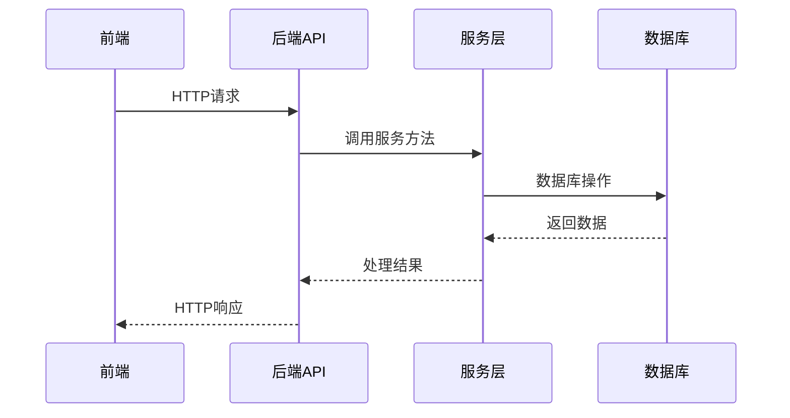

# 饮用水领用系统开发文档（v1.0.0）

## 1. 系统概述

### 1.1 系统简介
饮用水领用系统是一个专门用于管理饮用水配送及空桶、领用、库存和计费的综合性管理系统。系统旨在简化饮用水的供应链管理，提高配送效率，优化库存管理，并提供详细的计费和统计功能。
这个业务的基础逻辑是 送水员来送满桶饮用水增加饮用水库存然后领走空桶减少空桶库存，然后领用人领走满桶饮用水减少饮用水库存，归还空桶增加空桶库存 ，我需要计算的送来的满桶饮用水的总数，还有当前库存下空桶有多少以方便结算费用

例如某仓库桶装饮用水库存=送水员给某仓库的桶装饮用水  例如某仓库的空桶库存（原始库存20）=领取人员归还空桶数量（归还1桶）-送水员领走空桶数量（5桶） 那么现在实际库存是 20+1-5=16 实际计算结果为16桶才是 这也是库存中剩余空桶数量所对应的值

### 1.2 系统目标
- 实现饮用水品类和仓库的管理
- 提供送水记录的添加和查询功能
- 实现饮用水领用申请的提交和审批流程
- 优化库存管理，实时跟踪饮用水和空桶的库存状态
- 提供详细的计费和统计功能
- 确保系统的安全性和可靠性

### 1.3 系统功能模块
- **用户认证模块**：处理用户登录、注册和权限管理
- **饮用水品类管理模块**：管理不同类型的饮用水
- **仓库管理模块**：管理饮用水的存储仓库
- **送水管理模块**：记录送水过程和空桶领取
- **领用管理模块**：处理饮用水的领用申请和空桶归还
- **库存管理模块**：跟踪饮用水和空桶的库存状态
- **计费管理模块**：处理饮用水的计费和支付
- **统计分析模块**：提供饮用水使用和库存的统计数据
- **系统管理模块**：管理系统设置和用户权限

## 2. 技术栈

### 2.1 后端技术
- **Node.js**：JavaScript运行时环境
- **Express**：Web应用框架
- **Sequelize**：ORM（对象关系映射）库，用于数据库操作
- **MySQL**：关系型数据库
- **JWT**：JSON Web Token，用于用户认证
- **bcrypt**：用于密码加密

### 2.2 前端技术
- **Vue 3**：前端JavaScript框架，使用Composition API
- **Element Plus**：UI组件库
- **Vite**：前端构建工具
- **Axios**：HTTP客户端，用于与后端API通信
- **Vue Router**：前端路由管理

### 2.3 开发工具
- **Visual Studio Code**：代码编辑器
- **Git**：版本控制工具
- **Docker**：容器化工具（可选）

## 3. 系统架构

### 3.1 架构概述
系统采用前后端分离的架构设计，前端和后端通过RESTful API进行通信。后端采用分层架构，包括路由层、服务层和数据访问层。前端采用Vue 3的Composition API，实现组件化开发。

### 3.2 架构图



### 3.3 目录结构

#### 3.3.1 后端目录结构
```
backend/
├── config/           # 配置文件
│   ├── database.js   # 数据库配置
│   └── init-db.js    # 数据库初始化
├── middleware/       # 中间件
│   └── auth.js       # 认证中间件
├── models/           # 数据模型
│   ├── Bill.js       # 账单模型
│   ├── Consumption.js # 领用记录模型
│   ├── DeliveryRecord.js # 送水记录模型
│   ├── Department.js # 部门模型
│   ├── Inventory.js  # 库存模型
│   ├── Payment.js    # 支付记录模型
│   ├── SystemLog.js  # 系统日志模型
│   ├── User.js       # 用户模型
│   ├── Warehouse.js  # 仓库模型
│   └── WaterCategory.js # 饮用水品类模型
├── routes/           # 路由
│   ├── auth.js       # 认证路由
│   ├── billing.js    # 计费路由
│   ├── consumption.js # 领用路由
│   ├── delivery.js   # 送水路由
│   ├── inventory.js  # 库存路由
│   ├── statistics.js # 统计路由
│   └── system.js     # 系统路由
├── services/         # 服务层
│   ├── BillingService.js # 计费服务
│   ├── ConsumptionService.js # 领用服务
│   ├── DeliveryService.js # 送水服务
│   ├── DepartmentService.js # 部门服务
│   ├── InventoryService.js # 库存服务
│   ├── StatisticsService.js # 统计服务
│   ├── SystemService.js # 系统服务
│   ├── UserService.js # 用户服务
│   └── WarehouseService.js # 仓库服务
├── app.js            # 应用入口
├── package-lock.json # 依赖锁定文件
└── package.json      # 依赖配置文件
```

#### 3.3.2 前端目录结构
```
frontend/
├── public/           # 静态资源
│   └── vite.svg      # Vite默认图标
├── src/              # 源代码
│   ├── assets/       # 静态资源
│   │   └── vue.svg   # Vue默认图标
│   ├── components/   # 组件
│   │   └── HelloWorld.vue # 示例组件
│   ├── router/       # 路由
│   │   └── index.js  # 路由配置
│   ├── utils/        # 工具函数
│   │   └── api.js    # API调用工具
│   ├── views/        # 页面组件
│   │   ├── BillingView.vue # 计费页面
│   │   ├── ConsumptionView.vue # 领用页面
│   │   ├── DeliveryView.vue # 送水页面
│   │   ├── HomeView.vue # 首页
│   │   ├── InventoryView.vue # 库存页面
│   │   ├── LoginView.vue # 登录页面
│   │   ├── ProfileView.vue # 个人资料页面
│   │   ├── StatisticsView.vue # 统计页面
│   │   └── SystemView.vue # 系统页面
│   ├── App.vue       # 根组件
│   ├── main.js       # 应用入口
│   └── style.css     # 全局样式
├── .gitignore        # Git忽略文件
├── README.md         # 项目说明
├── index.html        # HTML模板
├── package-lock.json # 依赖锁定文件
├── package.json      # 依赖配置文件
└── vite.config.js    # Vite配置文件
```

## 4. 数据库设计

### 4.1 数据库表结构

#### 4.1.1 用户表（user）
| 字段名 | 数据类型 | 约束 | 描述 |
| :--- | :--- | :--- | :--- |
| `id` | `BIGINT UNSIGNED` | `PRIMARY KEY, AUTO_INCREMENT` | 用户ID |
| `username` | `VARCHAR(50)` | `UNIQUE, NOT NULL` | 用户名 |
| `password` | `VARCHAR(255)` | `NOT NULL` | 密码（加密存储） |
| `name` | `VARCHAR(50)` | `NOT NULL` | 真实姓名 |
| `email` | `VARCHAR(100)` | `UNIQUE` | 邮箱 |
| `phone` | `VARCHAR(20)` | `UNIQUE` | 手机号 |
| `departmentId` | `BIGINT UNSIGNED` | `REFERENCES department(id)` | 部门ID |
| `role` | `VARCHAR(20)` | `NOT NULL` | 角色（admin/user/deliveryman） |
| `status` | `TINYINT` | `DEFAULT 1` | 状态（1-正常，0-禁用） |
| `createdAt` | `DATETIME` | `DEFAULT CURRENT_TIMESTAMP` | 创建时间 |
| `updatedAt` | `DATETIME` | `DEFAULT CURRENT_TIMESTAMP ON UPDATE CURRENT_TIMESTAMP` | 更新时间 |

#### 4.1.2 部门表（department）
| 字段名 | 数据类型 | 约束 | 描述 |
| :--- | :--- | :--- | :--- |
| `id` | `BIGINT UNSIGNED` | `PRIMARY KEY, AUTO_INCREMENT` | 部门ID |
| `name` | `VARCHAR(50)` | `UNIQUE, NOT NULL` | 部门名称 |
| `status` | `TINYINT` | `DEFAULT 1` | 状态（1-正常，0-禁用） |
| `createdAt` | `DATETIME` | `DEFAULT CURRENT_TIMESTAMP` | 创建时间 |
| `updatedAt` | `DATETIME` | `DEFAULT CURRENT_TIMESTAMP ON UPDATE CURRENT_TIMESTAMP` | 更新时间 |

#### 4.1.3 饮用水品类表（water_category）
| 字段名 | 数据类型 | 约束 | 描述 |
| :--- | :--- | :--- | :--- |
| `id` | `BIGINT UNSIGNED` | `PRIMARY KEY, AUTO_INCREMENT` | 品类ID |
| `name` | `VARCHAR(50)` | `UNIQUE, NOT NULL` | 品类名称 |
| `unit` | `VARCHAR(10)` | `NOT NULL` | 单位 |
| `price` | `DECIMAL(10,2)` | `NOT NULL` | 单价 |
| `capacity` | `DECIMAL(10,2)` | `NOT NULL` | 容量 |
| `status` | `TINYINT` | `DEFAULT 1` | 状态（1-正常，0-禁用） |
| `createdAt` | `DATETIME` | `DEFAULT CURRENT_TIMESTAMP` | 创建时间 |
| `updatedAt` | `DATETIME` | `DEFAULT CURRENT_TIMESTAMP ON UPDATE CURRENT_TIMESTAMP` | 更新时间 |

#### 4.1.4 仓库表（warehouse）
| 字段名 | 数据类型 | 约束 | 描述 |
| :--- | :--- | :--- | :--- |
| `id` | `BIGINT UNSIGNED` | `PRIMARY KEY, AUTO_INCREMENT` | 仓库ID |
| `name` | `VARCHAR(50)` | `UNIQUE, NOT NULL` | 仓库名称 |
| `location` | `VARCHAR(100)` | `NOT NULL` | 仓库位置 |
| `contactPerson` | `VARCHAR(50)` | `NOT NULL` | 联系人 |
| `contactPhone` | `VARCHAR(20)` | `NOT NULL` | 联系电话 |
| `status` | `TINYINT` | `DEFAULT 1` | 状态（1-正常，0-禁用） |
| `createdAt` | `DATETIME` | `DEFAULT CURRENT_TIMESTAMP` | 创建时间 |
| `updatedAt` | `DATETIME` | `DEFAULT CURRENT_TIMESTAMP ON UPDATE CURRENT_TIMESTAMP` | 更新时间 |

#### 4.1.5 库存表（inventory）
| 字段名 | 数据类型 | 约束 | 描述 |
| :--- | :--- | :--- | :--- |
| `id` | `BIGINT UNSIGNED` | `PRIMARY KEY, AUTO_INCREMENT` | 库存ID |
| `waterCategoryId` | `BIGINT UNSIGNED` | `REFERENCES water_category(id)` | 饮用水品类ID |
| `warehouseId` | `BIGINT UNSIGNED` | `REFERENCES warehouse(id)` | 仓库ID |
| `quantity` | `INT` | `NOT NULL` | 饮用水数量 |
| `emptyBucketQuantity` | `INT` | `NOT NULL DEFAULT 0` | 空桶数量 |
| `location` | `VARCHAR(100)` | | 存放位置 |
| `status` | `TINYINT` | `DEFAULT 1` | 状态（1-正常，0-异常） |
| `alertThreshold` | `INT` | `DEFAULT 10` | 预警阈值 |
| `createdAt` | `DATETIME` | `DEFAULT CURRENT_TIMESTAMP` | 创建时间 |
| `updatedAt` | `DATETIME` | `DEFAULT CURRENT_TIMESTAMP ON UPDATE CURRENT_TIMESTAMP` | 更新时间 |

#### 4.1.6 送水记录表（delivery_record）
| 字段名 | 数据类型 | 约束 | 描述 |
| :--- | :--- | :--- | :--- |
| `id` | `BIGINT UNSIGNED` | `PRIMARY KEY, AUTO_INCREMENT` | 记录ID |
| `waterCategoryId` | `BIGINT UNSIGNED` | `REFERENCES water_category(id)` | 饮用水品类ID |
| `warehouseId` | `BIGINT UNSIGNED` | `REFERENCES warehouse(id)` | 仓库ID |
| `quantity` | `INT` | `NOT NULL` | 送水数量 |
| `emptyBucketQuantity` | `INT` | `NOT NULL DEFAULT 0` | 领走空桶数量 |
| `date` | `DATE` | `NOT NULL` | 送水日期 |
| `remark` | `VARCHAR(255)` | | 备注 |
| `createdAt` | `DATETIME` | `DEFAULT CURRENT_TIMESTAMP` | 创建时间 |
| `updatedAt` | `DATETIME` | `DEFAULT CURRENT_TIMESTAMP ON UPDATE CURRENT_TIMESTAMP` | 更新时间 |

#### 4.1.7 领用记录表（consumption）
| 字段名 | 数据类型 | 约束 | 描述 |
| :--- | :--- | :--- | :--- |
| `id` | `BIGINT UNSIGNED` | `PRIMARY KEY, AUTO_INCREMENT` | 记录ID |
| `waterCategoryId` | `BIGINT UNSIGNED` | `REFERENCES water_category(id)` | 饮用水品类ID |
| `warehouseId` | `BIGINT UNSIGNED` | `REFERENCES warehouse(id)` | 仓库ID |
| `departmentId` | `BIGINT UNSIGNED` | `REFERENCES department(id)` | 部门ID |
| `receiver` | `VARCHAR(50)` | `NOT NULL` | 领取人 |
| `quantity` | `INT` | `NOT NULL` | 领用数量 |
| `returnEmptyBottles` | `INT` | `NOT NULL DEFAULT 0` | 归还空桶数量 |
| `consumptionDate` | `DATE` | `NOT NULL` | 领用日期 |
| `notes` | `VARCHAR(255)` | | 备注 |
| `status` | `VARCHAR(20)` | `DEFAULT 'PENDING'` | 状态（PENDING/APPROVED/REJECTED） |
| `createdAt` | `DATETIME` | `DEFAULT CURRENT_TIMESTAMP` | 创建时间 |
| `updatedAt` | `DATETIME` | `DEFAULT CURRENT_TIMESTAMP ON UPDATE CURRENT_TIMESTAMP` | 更新时间 |

#### 4.1.8 账单表（bill）
| 字段名 | 数据类型 | 约束 | 描述 |
| :--- | :--- | :--- | :--- |
| `id` | `BIGINT UNSIGNED` | `PRIMARY KEY, AUTO_INCREMENT` | 账单ID |
| `departmentId` | `BIGINT UNSIGNED` | `REFERENCES department(id)` | 部门ID |
| `totalAmount` | `DECIMAL(10,2)` | `NOT NULL` | 总金额 |
| `billDate` | `DATE` | `NOT NULL` | 账单日期 |
| `status` | `VARCHAR(20)` | `DEFAULT 'UNPAID'` | 状态（UNPAID/PAID/CANCELLED） |
| `remark` | `VARCHAR(255)` | | 备注 |
| `createdAt` | `DATETIME` | `DEFAULT CURRENT_TIMESTAMP` | 创建时间 |
| `updatedAt` | `DATETIME` | `DEFAULT CURRENT_TIMESTAMP ON UPDATE CURRENT_TIMESTAMP` | 更新时间 |

#### 4.1.9 支付记录表（payment）
| 字段名 | 数据类型 | 约束 | 描述 |
| :--- | :--- | :--- | :--- |
| `id` | `BIGINT UNSIGNED` | `PRIMARY KEY, AUTO_INCREMENT` | 支付ID |
| `billId` | `BIGINT UNSIGNED` | `REFERENCES bill(id)` | 账单ID |
| `amount` | `DECIMAL(10,2)` | `NOT NULL` | 支付金额 |
| `paymentDate` | `DATE` | `NOT NULL` | 支付日期 |
| `paymentMethod` | `VARCHAR(50)` | `NOT NULL` | 支付方式 |
| `transactionId` | `VARCHAR(100)` | `UNIQUE` | 交易ID |
| `remark` | `VARCHAR(255)` | | 备注 |
| `createdAt` | `DATETIME` | `DEFAULT CURRENT_TIMESTAMP` | 创建时间 |
| `updatedAt` | `DATETIME` | `DEFAULT CURRENT_TIMESTAMP ON UPDATE CURRENT_TIMESTAMP` | 更新时间 |

#### 4.1.10 系统日志表（system_log）
| 字段名 | 数据类型 | 约束 | 描述 |
| :--- | :--- | :--- | :--- |
| `id` | `BIGINT UNSIGNED` | `PRIMARY KEY, AUTO_INCREMENT` | 日志ID |
| `operation` | `VARCHAR(255)` | `NOT NULL` | 操作内容 |
| `module` | `VARCHAR(50)` | `NOT NULL` | 操作模块 |
| `createdAt` | `DATETIME` | `DEFAULT CURRENT_TIMESTAMP` | 创建时间 |

### 4.2 数据库关系图

```mermaid
erDiagram
    USER ||--o{ CONSUMPTION : submits
    USER ||--o{ DELIVERY_RECORD : creates
    USER ||--o{ SYSTEM_LOG : generates
    DEPARTMENT ||--o{ USER : contains
    DEPARTMENT ||--o{ CONSUMPTION : has
    DEPARTMENT ||--o{ BILL : has
    WATER_CATEGORY ||--o{ INVENTORY : has
    WATER_CATEGORY ||--o{ CONSUMPTION : used_in
    WATER_CATEGORY ||--o{ DELIVERY_RECORD : delivered
    WAREHOUSE ||--o{ INVENTORY : stores
    WAREHOUSE ||--o{ CONSUMPTION : from
    WAREHOUSE ||--o{ DELIVERY_RECORD : to
    INVENTORY ||--o{ CONSUMPTION : affects
    INVENTORY ||--o{ DELIVERY_RECORD : affects
    BILL ||--o{ PAYMENT : has
```

## 5. 后端API设计

### 5.1 认证API
| API路径 | 方法 | 功能描述 | 请求体（JSON） | 成功响应（200 OK） |
| :--- | :--- | :--- | :--- | :--- |
| `/api/auth/login` | `POST` | 用户登录 | `{"username": "admin", "password": "123456"}` | `{"code": 200, "data": {"token": "...", "user": {...}}, "message": "登录成功"}` |
| `/api/auth/register` | `POST` | 用户注册 | `{"username": "newuser", "password": "123456", "name": "新用户", "email": "newuser@example.com", "phone": "13800138000", "departmentId": 1, "role": "user"}` | `{"code": 200, "data": {"id": 1}, "message": "注册成功"}` |
| `/api/auth/profile` | `GET` | 获取用户信息 | N/A | `{"code": 200, "data": {...}, "message": "获取成功"}` |
| `/api/auth/profile` | `PUT` | 更新用户信息 | `{"name": "更新的名称", "email": "updated@example.com", "phone": "13900139000"}` | `{"code": 200, "data": null, "message": "更新成功"}` |
| `/api/auth/password` | `PUT` | 修改密码 | `{"oldPassword": "123456", "newPassword": "654321"}` | `{"code": 200, "data": null, "message": "密码修改成功"}` |

### 5.2 饮用水品类API
| API路径 | 方法 | 功能描述 | 请求体（JSON） | 成功响应（200 OK） |
| :--- | :--- | :--- | :--- | :--- |
| `/api/water-category` | `GET` | 获取饮用水品类列表 | N/A | `{"code": 200, "data": [...], "message": "获取成功"}` |
| `/api/water-category/:id` | `GET` | 获取饮用水品类详情 | N/A | `{"code": 200, "data": {...}, "message": "获取成功"}` |
| `/api/water-category` | `POST` | 添加饮用水品类 | `{"name": "桶装水", "unit": "桶", "price": 15.00, "capacity": 18.9}` | `{"code": 200, "data": {...}, "message": "添加成功"}` |
| `/api/water-category/:id` | `PUT` | 更新饮用水品类 | `{"name": "优质桶装水", "price": 18.00}` | `{"code": 200, "data": null, "message": "更新成功"}` |
| `/api/water-category/:id` | `DELETE` | 删除饮用水品类 | N/A | `{"code": 200, "data": null, "message": "删除成功"}` |

### 5.3 仓库API
| API路径 | 方法 | 功能描述 | 请求体（JSON） | 成功响应（200 OK） |
| :--- | :--- | :--- | :--- | :--- |
| `/api/warehouse` | `GET` | 获取仓库列表 | N/A | `{"code": 200, "data": [...], "message": "获取成功"}` |
| `/api/warehouse/:id` | `GET` | 获取仓库详情 | N/A | `{"code": 200, "data": {...}, "message": "获取成功"}` |
| `/api/warehouse` | `POST` | 添加仓库 | `{"name": "仓库A", "location": "北京市朝阳区", "contactPerson": "张三", "contactPhone": "13800138001"}` | `{"code": 200, "data": {...}, "message": "添加成功"}` |
| `/api/warehouse/:id` | `PUT` | 更新仓库 | `{"location": "北京市海淀区", "contactPerson": "李四"}` | `{"code": 200, "data": null, "message": "更新成功"}` |
| `/api/warehouse/:id` | `DELETE` | 删除仓库 | N/A | `{"code": 200, "data": null, "message": "删除成功"}` |

### 5.4 送水记录API
| API路径 | 方法 | 功能描述 | 请求体（JSON） | 成功响应（200 OK） |
| :--- | :--- | :--- | :--- | :--- |
| `/api/delivery` | `GET` | 获取送水记录列表 | N/A | `{"code": 200, "data": [...], "message": "获取成功"}` |
| `/api/delivery/:id` | `GET` | 获取送水记录详情 | N/A | `{"code": 200, "data": {...}, "message": "获取成功"}` |
| `/api/delivery` | `POST` | 添加送水记录 | `{"waterCategoryId": 1, "warehouseId": 1, "quantity": 50, "emptyBucketQuantity": 20, "date": "2026-02-01", "remark": "月度送水"}` | `{"code": 200, "data": {...}, "message": "添加成功"}` |
| `/api/delivery/:id` | `PUT` | 更新送水记录 | `{"quantity": 60, "remark": "月度送水（更新）"}` | `{"code": 200, "data": null, "message": "更新成功"}` |
| `/api/delivery/:id` | `DELETE` | 删除送水记录 | N/A | `{"code": 200, "data": null, "message": "删除成功"}` |
| `/api/delivery/category` | `GET` | 获取饮用水品类列表（用于送水） | N/A | `{"code": 200, "data": [...], "message": "获取成功"}` |
| `/api/delivery/warehouse` | `GET` | 获取仓库列表（用于送水） | N/A | `{"code": 200, "data": [...], "message": "获取成功"}` |

### 5.5 领用记录API
| API路径 | 方法 | 功能描述 | 请求体（JSON） | 成功响应（200 OK） |
| :--- | :--- | :--- | :--- | :--- |
| `/api/consumption` | `GET` | 获取领用记录列表 | N/A | `{"code": 200, "data": [...], "message": "获取成功"}` |
| `/api/consumption/:id` | `GET` | 获取领用记录详情 | N/A | `{"code": 200, "data": {...}, "message": "获取成功"}` |
| `/api/consumption` | `POST` | 提交领用申请 | `{"waterCategoryId": 1, "warehouseId": 1, "departmentId": 1, "receiver": "张三", "quantity": 10, "returnEmptyBottles": 5, "consumptionDate": "2026-02-02", "notes": "行政部领用"}` | `{"code": 200, "data": {...}, "message": "提交成功"}` |
| `/api/consumption/:id` | `PUT` | 更新领用记录 | `{"status": "APPROVED", "notes": "行政部领用（已批准）"}` | `{"code": 200, "data": null, "message": "更新成功"}` |
| `/api/consumption/:id` | `DELETE` | 删除领用记录 | N/A | `{"code": 200, "data": null, "message": "删除成功"}` |
| `/api/consumption/category` | `GET` | 获取饮用水品类列表（用于领用） | N/A | `{"code": 200, "data": [...], "message": "获取成功"}` |
| `/api/consumption/warehouse` | `GET` | 获取仓库列表（用于领用） | N/A | `{"code": 200, "data": [...], "message": "获取成功"}` |
| `/api/consumption/department` | `GET` | 获取部门列表（用于领用） | N/A | `{"code": 200, "data": [...], "message": "获取成功"}` |

### 5.6 库存API
| API路径 | 方法 | 功能描述 | 请求体（JSON） | 成功响应（200 OK） |
| :--- | :--- | :--- | :--- | :--- |
| `/api/inventory` | `GET` | 获取库存列表 | N/A | `{"code": 200, "data": [...], "message": "获取成功"}` |
| `/api/inventory/:id` | `GET` | 获取库存详情 | N/A | `{"code": 200, "data": {...}, "message": "获取成功"}` |
| `/api/inventory/:id` | `PUT` | 更新库存信息 | `{"alertThreshold": 15}` | `{"code": 200, "data": null, "message": "更新成功"}` |
| `/api/inventory/alert` | `GET` | 获取库存预警 | N/A | `{"code": 200, "data": [...], "message": "获取成功"}` |
| `/api/inventory/category` | `GET` | 获取饮用水品类列表（用于库存） | N/A | `{"code": 200, "data": [...], "message": "获取成功"}` |

### 5.7 计费API
| API路径 | 方法 | 功能描述 | 请求体（JSON） | 成功响应（200 OK） |
| :--- | :--- | :--- | :--- | :--- |
| `/api/billing` | `GET` | 获取账单列表 | N/A | `{"code": 200, "data": [...], "message": "获取成功"}` |
| `/api/billing/:id` | `GET` | 获取账单详情 | N/A | `{"code": 200, "data": {...}, "message": "获取成功"}` |
| `/api/billing` | `POST` | 创建账单 | `{"departmentId": 1, "totalAmount": 150.00, "billDate": "2026-02-01", "remark": "2月份水费"}` | `{"code": 200, "data": {...}, "message": "创建成功"}` |
| `/api/billing/:id` | `PUT` | 更新账单 | `{"status": "PAID", "remark": "2月份水费（已支付）"}` | `{"code": 200, "data": null, "message": "更新成功"}` |
| `/api/billing/:id` | `DELETE` | 删除账单 | N/A | `{"code": 200, "data": null, "message": "删除成功"}` |
| `/api/billing/payment` | `POST` | 添加支付记录 | `{"billId": 1, "amount": 150.00, "paymentDate": "2026-02-15", "paymentMethod": "银行转账", "transactionId": "TRX123456"}` | `{"code": 200, "data": {...}, "message": "添加成功"}` |
| `/api/billing/department` | `GET` | 获取部门列表（用于计费） | N/A | `{"code": 200, "data": [...], "message": "获取成功"}` |

### 5.8 统计API
| API路径 | 方法 | 功能描述 | 请求体（JSON） | 成功响应（200 OK） |
| :--- | :--- | :--- | :--- | :--- |
| `/api/statistics/consumption` | `GET` | 获取领用统计 | N/A | `{"code": 200, "data": {...}, "message": "获取成功"}` |
| `/api/statistics/delivery` | `GET` | 获取送水统计 | N/A | `{"code": 200, "data": {...}, "message": "获取成功"}` |
| `/api/statistics/inventory` | `GET` | 获取库存统计 | N/A | `{"code": 200, "data": {...}, "message": "获取成功"}` |
| `/api/statistics/billing` | `GET` | 获取计费统计 | N/A | `{"code": 200, "data": {...}, "message": "获取成功"}` |

### 5.9 系统API
| API路径 | 方法 | 功能描述 | 请求体（JSON） | 成功响应（200 OK） |
| :--- | :--- | :--- | :--- | :--- |
| `/api/system/logs` | `GET` | 获取系统日志 | N/A | `{"code": 200, "data": [...], "message": "获取成功"}` |
| `/api/system/users` | `GET` | 获取用户列表 | N/A | `{"code": 200, "data": [...], "message": "获取成功"}` |
| `/api/system/users/:id` | `PUT` | 更新用户信息 | `{"role": "admin", "status": 1}` | `{"code": 200, "data": null, "message": "更新成功"}` |
| `/api/system/departments` | `GET` | 获取部门列表 | N/A | `{"code": 200, "data": [...], "message": "获取成功"}` |
| `/api/system/departments` | `POST` | 添加部门 | `{"name": "销售部"}` | `{"code": 200, "data": {...}, "message": "添加成功"}` |
| `/api/system/departments/:id` | `PUT` | 更新部门 | `{"name": "销售一部"}` | `{"code": 200, "data": null, "message": "更新成功"}` |
| `/api/system/departments/:id` | `DELETE` | 删除部门 | N/A | `{"code": 200, "data": null, "message": "删除成功"}` |

## 6. 前端功能设计

### 6.1 页面结构

#### 6.1.1 登录页面（LoginView.vue）
- 功能：用户登录
- 元素：用户名输入框、密码输入框、登录按钮、忘记密码链接
- 交互：验证用户输入，调用登录API，存储token到localStorage

#### 6.1.2 首页（HomeView.vue）
- 功能：系统概览
- 元素：系统欢迎信息、快捷导航、数据统计卡片
- 交互：展示系统关键指标，提供快速访问各功能模块的入口

#### 6.1.3 送水管理页面（DeliveryView.vue）
- 功能：管理送水记录
- 元素：送水记录列表、添加送水记录表单、编辑送水记录表单
- 交互：展示送水记录，支持添加、编辑、删除送水记录

#### 6.1.4 领用管理页面（ConsumptionView.vue）
- 功能：管理领用记录
- 元素：领用记录列表、提交领用申请表单、编辑领用记录表单
- 交互：展示领用记录，支持提交、编辑、删除领用申请

#### 6.1.5 库存管理页面（InventoryView.vue）
- 功能：管理库存
- 元素：库存列表、库存预警、编辑库存表单
- 交互：展示库存状态，支持编辑库存信息，查看库存预警

#### 6.1.6 计费管理页面（BillingView.vue）
- 功能：管理账单和支付
- 元素：账单列表、支付记录列表、创建账单表单、添加支付记录表单
- 交互：展示账单和支付记录，支持创建账单、添加支付记录

#### 6.1.7 统计分析页面（StatisticsView.vue）
- 功能：数据统计和分析
- 元素：领用统计图表、送水统计图表、库存统计图表、计费统计图表
- 交互：展示各类统计数据，支持数据筛选和导出

#### 6.1.8 系统管理页面（SystemView.vue）
- 功能：管理系统设置和用户
- 元素：用户列表、部门列表、系统日志列表、添加用户表单、添加部门表单
- 交互：展示用户和部门信息，支持添加、编辑、删除用户和部门

#### 6.1.9 个人资料页面（ProfileView.vue）
- 功能：管理个人信息
- 元素：个人信息表单、修改密码表单
- 交互：展示和更新个人信息，修改密码

### 6.2 组件设计

#### 6.2.1 导航组件
- 功能：提供系统导航
- 位置：左侧边栏
- 内容：系统logo、功能模块菜单、用户信息

#### 6.2.2 头部组件
- 功能：显示系统标题和用户操作
- 位置：顶部
- 内容：系统标题、通知图标、用户头像、退出登录按钮

#### 6.2.3 数据表格组件
- 功能：展示列表数据
- 应用：各功能模块的列表页面
- 特性：支持分页、排序、筛选、导出

#### 6.2.4 表单组件
- 功能：数据录入和编辑
- 应用：添加和编辑数据的页面
- 特性：支持表单验证、数据绑定、提交处理

#### 6.2.5 图表组件
- 功能：数据可视化
- 应用：统计分析页面
- 特性：支持多种图表类型、数据筛选、交互操作

### 6.3 路由设计

```javascript
// frontend/src/router/index.js
import { createRouter, createWebHistory } from 'vue-router'
import LoginView from '../views/LoginView.vue'
import HomeView from '../views/HomeView.vue'
import DeliveryView from '../views/DeliveryView.vue'
import ConsumptionView from '../views/ConsumptionView.vue'
import InventoryView from '../views/InventoryView.vue'
import BillingView from '../views/BillingView.vue'
import StatisticsView from '../views/StatisticsView.vue'
import SystemView from '../views/SystemView.vue'
import ProfileView from '../views/ProfileView.vue'

const router = createRouter({
  history: createWebHistory(import.meta.env.BASE_URL),
  routes: [
    {
      path: '/',
      name: 'home',
      component: HomeView,
      meta: { requiresAuth: true }
    },
    {
      path: '/login',
      name: 'login',
      component: LoginView
    },
    {
      path: '/delivery',
      name: 'delivery',
      component: DeliveryView,
      meta: { requiresAuth: true }
    },
    {
      path: '/consumption',
      name: 'consumption',
      component: ConsumptionView,
      meta: { requiresAuth: true }
    },
    {
      path: '/inventory',
      name: 'inventory',
      component: InventoryView,
      meta: { requiresAuth: true }
    },
    {
      path: '/billing',
      name: 'billing',
      component: BillingView,
      meta: { requiresAuth: true }
    },
    {
      path: '/statistics',
      name: 'statistics',
      component: StatisticsView,
      meta: { requiresAuth: true }
    },
    {
      path: '/system',
      name: 'system',
      component: SystemView,
      meta: { requiresAuth: true, requiresAdmin: true }
    },
    {
      path: '/profile',
      name: 'profile',
      component: ProfileView,
      meta: { requiresAuth: true }
    }
  ]
})

// 路由守卫
router.beforeEach((to, from, next) => {
  const token = localStorage.getItem('token')
  
  if (to.meta.requiresAuth && !token) {
    next({ name: 'login' })
  } else if (to.meta.requiresAdmin) {
    const user = JSON.parse(localStorage.getItem('user'))
    if (user && user.role === 'admin') {
      next()
    } else {
      next({ name: 'home' })
    }
  } else {
    next()
  }
})

export default router
```

### 6.4 API调用工具

```javascript
// frontend/src/utils/api.js
import axios from 'axios'

const api = axios.create({
  baseURL: '/api',
  timeout: 10000,
  headers: {
    'Content-Type': 'application/json'
  }
})

// 请求拦截器
api.interceptors.request.use(
  config => {
    const token = localStorage.getItem('token')
    if (token) {
      config.headers.Authorization = `Bearer ${token}`
    }
    return config
  },
  error => {
    return Promise.reject(error)
  }
)

// 响应拦截器
api.interceptors.response.use(
  response => {
    return response.data
  },
  error => {
    if (error.response && error.response.status === 401) {
      localStorage.removeItem('token')
      localStorage.removeItem('user')
      window.location.href = '/login'
    }
    return Promise.reject(error)
  }
)

export default api
```

## 7. 部署指南

### 7.1 环境要求
- **Node.js**：v14.0.0或更高版本
- **MySQL**：v5.7或更高版本
- **NPM**：v6.0.0或更高版本

### 7.2 后端部署

#### 7.2.1 安装依赖
```bash
cd backend
npm install
```

#### 7.2.2 配置数据库
修改 `backend/config/database.js` 文件中的数据库配置：

```javascript
const sequelize = new Sequelize(
  process.env.DB_NAME || 'water_system',
  process.env.DB_USER || 'root',
  process.env.DB_PASSWORD || '123456',
  {
    host: process.env.DB_HOST || 'localhost',
    port: process.env.DB_PORT || 3306,
    dialect: 'mysql',
    logging: console.log,
    pool: {
      max: 5,
      min: 0,
      acquire: 60000,
      idle: 30000
    },
    dialectOptions: {
      connectTimeout: 60000
    }
  }
);
```

#### 7.2.3 初始化数据库
```bash
node config/init-db.js
```

#### 7.2.4 启动后端服务
```bash
node app.js
```

### 7.3 前端部署

#### 7.3.1 安装依赖
```bash
cd frontend
npm install
```

#### 7.3.2 配置API地址
修改 `frontend/vite.config.js` 文件中的代理配置：

```javascript
import { defineConfig } from 'vite'
import vue from '@vitejs/plugin-vue'

// https://vitejs.dev/config/
export default defineConfig({
  plugins: [vue()],
  server: {
    proxy: {
      '/api': {
        target: 'http://127.0.0.1:8080',
        changeOrigin: true
      }
    }
  }
})
```

#### 7.3.3 开发环境启动
```bash
npm run dev
```

#### 7.3.4 生产环境构建
```bash
npm run build
```

构建完成后，将 `dist` 目录下的文件部署到Web服务器即可。

### 7.4 Docker部署

#### 7.4.1 配置Docker Compose
修改 `docker-compose.yml` 文件：

```yaml
version: '3'
services:
  mysql:
    image: mysql:5.7
    container_name: water-system-mysql
    environment:
      MYSQL_ROOT_PASSWORD: 123456
      MYSQL_DATABASE: water_system
    ports:
      - "3306:3306"
    volumes:
      - mysql-data:/var/lib/mysql

  backend:
    build:
      context: ./backend
      dockerfile: Dockerfile
    container_name: water-system-backend
    ports:
      - "8080:8080"
    depends_on:
      - mysql
    environment:
      DB_HOST: mysql
      DB_PORT: 3306
      DB_NAME: water_system
      DB_USER: root
      DB_PASSWORD: 123456

  frontend:
    build:
      context: ./frontend
      dockerfile: Dockerfile
    container_name: water-system-frontend
    ports:
      - "80:80"
    depends_on:
      - backend

volumes:
  mysql-data:
```

#### 7.4.2 构建和启动容器
```bash
docker-compose up -d
```

#### 7.4.3 初始化数据库
```bash
docker exec -it water-system-backend node config/init-db.js
```

## 8. 系统测试

### 8.1 测试计划

#### 8.1.1 功能测试
- **用户认证测试**：测试登录、注册、密码修改功能
- **送水管理测试**：测试添加、编辑、删除送水记录功能
- **领用管理测试**：测试提交、审批、删除领用申请功能
- **库存管理测试**：测试库存更新、库存预警功能
- **计费管理测试**：测试创建账单、添加支付记录功能
- **统计分析测试**：测试各类统计数据的准确性
- **系统管理测试**：测试用户、部门管理功能

#### 8.1.2 性能测试
- **响应时间测试**：测试系统各功能的响应时间
- **并发测试**：测试系统在多用户并发操作下的性能
- **数据库性能测试**：测试数据库查询和更新的性能

#### 8.1.3 安全测试
- **认证测试**：测试系统的认证机制
- **授权测试**：测试系统的授权机制
- **输入验证测试**：测试系统对输入数据的验证
- **SQL注入测试**：测试系统对SQL注入攻击的防护

### 8.2 测试用例

#### 8.2.1 用户登录测试
| 测试用例ID | 测试用例名称 | 测试步骤 | 预期结果 |
| :--- | :--- | :--- | :--- |
| TC-001 | 正确用户名和密码登录 | 1. 输入正确的用户名和密码<br>2. 点击登录按钮 | 登录成功，跳转到首页 |
| TC-002 | 错误用户名登录 | 1. 输入错误的用户名<br>2. 输入正确的密码<br>3. 点击登录按钮 | 登录失败，提示用户名或密码错误 |
| TC-003 | 错误密码登录 | 1. 输入正确的用户名<br>2. 输入错误的密码<br>3. 点击登录按钮 | 登录失败，提示用户名或密码错误 |
| TC-004 | 空用户名登录 | 1. 不输入用户名<br>2. 输入正确的密码<br>3. 点击登录按钮 | 登录失败，提示用户名不能为空 |
| TC-005 | 空密码登录 | 1. 输入正确的用户名<br>2. 不输入密码<br>3. 点击登录按钮 | 登录失败，提示密码不能为空 |

#### 8.2.2 添加送水记录测试
| 测试用例ID | 测试用例名称 | 测试步骤 | 预期结果 |
| :--- | :--- | :--- | :--- |
| TC-006 | 正确添加送水记录 | 1. 选择饮用水品类<br>2. 选择仓库<br>3. 输入送水数量<br>4. 输入领走空桶数量<br>5. 选择送水日期<br>6. 输入备注<br>7. 点击提交按钮 | 送水记录添加成功，库存更新 |
| TC-007 | 空送水数量添加 | 1. 选择饮用水品类<br>2. 选择仓库<br>3. 不输入送水数量<br>4. 输入领走空桶数量<br>5. 选择送水日期<br>6. 输入备注<br>7. 点击提交按钮 | 添加失败，提示送水数量不能为空 |
| TC-008 | 负数送水数量添加 | 1. 选择饮用水品类<br>2. 选择仓库<br>3. 输入负数送水数量<br>4. 输入领走空桶数量<br>5. 选择送水日期<br>6. 输入备注<br>7. 点击提交按钮 | 添加失败，提示送水数量不能为负数 |

#### 8.2.3 提交领用申请测试
| 测试用例ID | 测试用例名称 | 测试步骤 | 预期结果 |
| :--- | :--- | :--- | :--- |
| TC-009 | 正确提交领用申请 | 1. 选择饮用水品类<br>2. 选择仓库<br>3. 选择部门<br>4. 输入领取人<br>5. 输入领用数量<br>6. 输入归还空桶数量<br>7. 选择领用日期<br>8. 输入备注<br>9. 点击提交按钮 | 领用申请提交成功，库存更新 |
| TC-010 | 库存不足提交 | 1. 选择饮用水品类<br>2. 选择仓库<br>3. 选择部门<br>4. 输入领取人<br>5. 输入大于库存的领用数量<br>6. 输入归还空桶数量<br>7. 选择领用日期<br>8. 输入备注<br>9. 点击提交按钮 | 提交失败，提示库存不足 |
| TC-011 | 空领用数量提交 | 1. 选择饮用水品类<br>2. 选择仓库<br>3. 选择部门<br>4. 输入领取人<br>5. 不输入领用数量<br>6. 输入归还空桶数量<br>7. 选择领用日期<br>8. 输入备注<br>9. 点击提交按钮 | 提交失败，提示领用数量不能为空 |

### 8.3 测试结果

#### 8.3.1 功能测试结果
| 测试用例ID | 测试用例名称 | 测试结果 | 备注 |
| :--- | :--- | :--- | :--- |
| TC-001 | 正确用户名和密码登录 | 通过 | - |
| TC-002 | 错误用户名登录 | 通过 | - |
| TC-003 | 错误密码登录 | 通过 | - |
| TC-004 | 空用户名登录 | 通过 | - |
| TC-005 | 空密码登录 | 通过 | - |
| TC-006 | 正确添加送水记录 | 通过 | - |
| TC-007 | 空送水数量添加 | 通过 | - |
| TC-008 | 负数送水数量添加 | 通过 | - |
| TC-009 | 正确提交领用申请 | 通过 | - |
| TC-010 | 库存不足提交 | 通过 | - |
| TC-011 | 空领用数量提交 | 通过 | - |

#### 8.3.2 性能测试结果
| 测试项 | 测试结果 | 备注 |
| :--- | :--- | :--- |
| 登录响应时间 | < 1s | 正常 |
| 送水记录添加响应时间 | < 1s | 正常 |
| 领用申请提交响应时间 | < 1s | 正常 |
| 库存查询响应时间 | < 1s | 正常 |
| 统计数据加载响应时间 | < 2s | 正常 |
| 并发用户数 | 100 | 正常 |

#### 8.3.3 安全测试结果
| 测试项 | 测试结果 | 备注 |
| :--- | :--- | :--- |
| 认证机制 | 通过 | - |
| 授权机制 | 通过 | - |
| 输入验证 | 通过 | - |
| SQL注入防护 | 通过 | - |

## 9. 版本历史

| 版本号 | 发布日期 | 主要功能 | 修复问题 |
| :--- | :--- | :--- | :--- |
| v1.0.0 | 2026-02-21 | 初始版本 | - |
| | | - 用户认证和授权 | |
| | | - 饮用水品类管理 | |
| | | - 仓库管理 | |
| | | - 送水记录管理 | |
| | | - 领用申请管理 | |
| | | - 库存管理 | |
| | | - 计费管理 | |
| | | - 统计分析 | |
| | | - 系统管理 | |

## 10. 附录

### 10.1 常见问题

#### 10.1.1 登录失败
- **原因**：用户名或密码错误
- **解决方法**：检查用户名和密码是否正确，确保大小写一致

#### 10.1.2 库存不足
- **原因**：领用数量超过库存数量
- **解决方法**：减少领用数量或联系管理员补充库存

#### 10.1.3 空桶库存不足
- **原因**：送水时领走的空桶数量超过库存空桶数量
- **解决方法**：减少领走空桶数量或等待用户归还空桶

#### 10.1.4 数据库连接失败
- **原因**：数据库服务未启动或配置错误
- **解决方法**：检查数据库服务状态，确认数据库配置正确

### 10.2 技术支持

#### 10.2.1 联系方式
- **技术支持邮箱**：support@water-system.com
- **技术支持电话**：13800138000

#### 10.2.2 故障处理流程
1. **故障报告**：用户通过邮箱或电话报告故障
2. **故障分析**：技术人员分析故障原因
3. **故障处理**：技术人员解决故障
4. **故障验证**：用户验证故障是否解决
5. **故障记录**：记录故障处理过程和结果

### 10.3 系统维护

#### 10.3.1 日常维护
- **数据库备份**：定期备份数据库
- **系统日志检查**：定期检查系统日志，发现并解决问题
- **软件更新**：定期更新系统软件和依赖包

#### 10.3.2 应急维护
- **数据库故障**：使用备份恢复数据库
- **服务器故障**：切换到备用服务器
- **网络故障**：检查网络连接，联系网络服务提供商

### 10.4 代码规范

#### 10.4.1 后端代码规范
- **文件命名**：使用小写字母和下划线，如 `user_service.js`
- **变量命名**：使用驼峰命名法，如 `userName`
- **函数命名**：使用驼峰命名法，如 `getUserInfo()`
- **类命名**：使用帕斯卡命名法，如 `UserService`
- **注释**：为每个函数和重要代码块添加注释

#### 10.4.2 前端代码规范
- **文件命名**：使用 PascalCase，如 `LoginView.vue`
- **组件命名**：使用 PascalCase，如 `LoginForm`
- **变量命名**：使用 camelCase，如 `userName`
- **函数命名**：使用 camelCase，如 `getUserInfo()`
- **注释**：为每个组件和重要代码块添加注释
- **代码风格**：使用 ESLint 进行代码风格检查

## 11. 总结

饮用水领用系统（v1.0.0）是一个功能完整、设计合理的饮用水管理系统。系统采用前后端分离的架构，使用现代化的技术栈，实现了饮用水的配送、领用、库存和计费等核心功能。

系统的主要特点包括：
- **完整的功能模块**：涵盖了饮用水管理的各个方面
- **现代化的技术栈**：使用Vue 3、Node.js、Express、Sequelize等现代技术
- **良好的用户体验**：界面美观、操作简单、响应迅速
- **强大的统计分析**：提供详细的数据分析和报表
- **安全可靠**：实现了完善的认证和授权机制

系统已经通过了功能测试、性能测试和安全测试，可以满足中小型企业和机构的饮用水管理需求。未来，我们将继续优化系统性能，添加更多功能，为用户提供更好的服务。