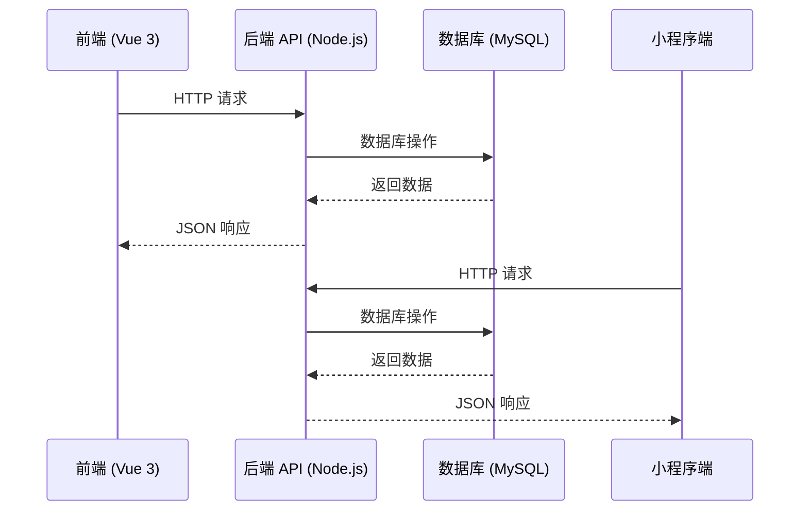
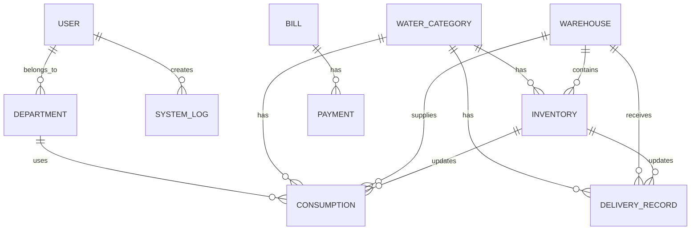
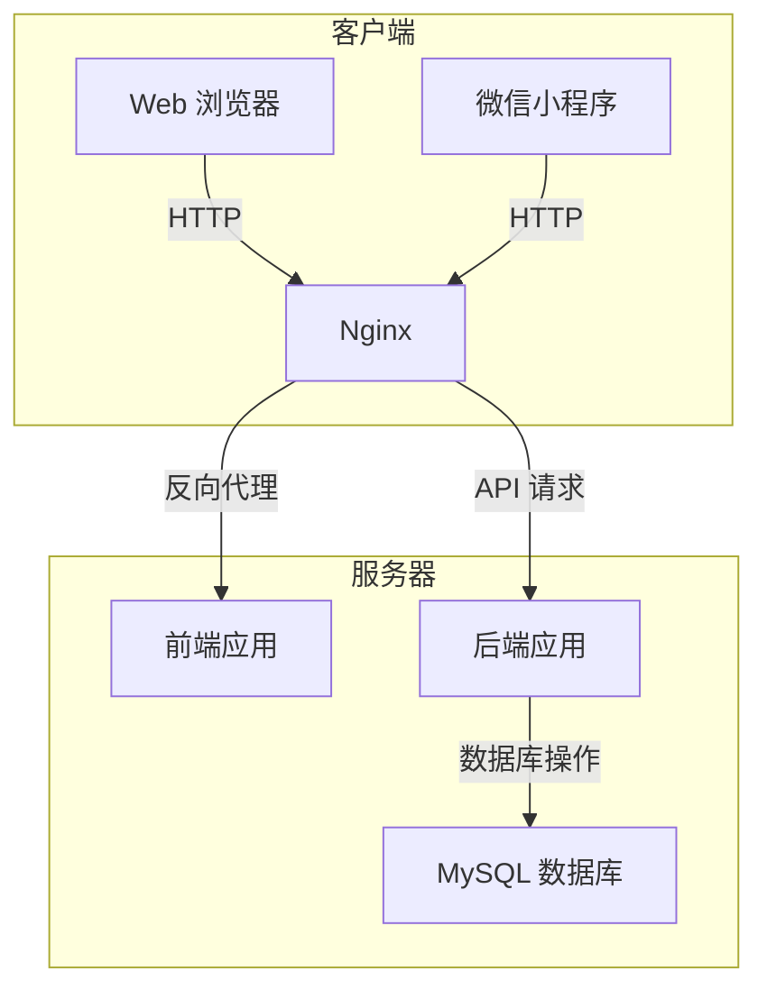

# 饮用水领用系统开发设计文档 v1.0.3

## 1. 系统概述

本系统是一个基于前后端分离架构的饮用水领用管理系统，主要用于企业内部的饮用水配送、库存管理、领用记录和账单结算等功能。系统支持管理员、普通用户和送水员三种角色，提供Web端和小程序端两种访问方式。

### 1.1 系统目标
- 实现饮用水配送全流程管理
- 实时监控库存状态，避免缺货
- 规范饮用水领用流程，提高管理效率
- 提供数据统计分析，辅助决策
- 支持移动端便捷操作

### 1.2 系统版本
- 当前版本：v1.0.3
- 开发日期：2026-02-22

## 2. 技术架构

### 2.1 架构概述
本系统采用前后端分离架构，使用现代化的技术栈实现。



### 2.2 技术栈

| 分类 | 技术 | 版本 | 用途 |
| :--- | :--- | :--- | :--- |
| 后端 | Node.js | 16+ | 运行环境 |
| 后端 | Express | 4.18+ | Web 框架 |
| 后端 | Sequelize | 6.37+ | ORM 工具 |
| 后端 | MySQL | 8.0+ | 数据库 |
| 前端 | Vue.js | 3.4+ | 前端框架 |
| 前端 | Element Plus | 2.5+ | UI 组件库 |
| 前端 | Vue Router | 4.2+ | 路由管理 |
| 前端 | Vite | 5.0+ | 构建工具 |
| 小程序 | 微信小程序 | - | 移动端访问 |
| 部署 | Docker | 20.10+ | 容器化部署 |
| 部署 | Docker Compose | 2.23+ | 多容器管理 |

## 3. 系统架构设计

### 3.1 目录结构

```plaintext
water-node+vue/
├── backend/                 # 后端应用
│   ├── config/              # 配置文件
│   ├── middleware/          # 中间件
│   ├── models/              # 数据模型
│   ├── routes/              # 路由
│   ├── services/            # 业务逻辑
│   ├── app.js               # 应用入口
│   └── package.json         # 依赖配置
├── frontend/                # 前端应用
│   ├── public/              # 静态资源
│   ├── src/                 # 源代码
│   │   ├── assets/          # 资源文件
│   │   ├── components/      # 组件
│   │   ├── router/          # 路由
│   │   ├── utils/           # 工具函数
│   │   ├── views/           # 页面
│   │   ├── App.vue          # 根组件
│   │   └── main.js          # 入口文件
│   └── package.json         # 依赖配置
├── water-mini-app/          # 小程序应用
│   ├── pages/               # 页面
│   └── utils/               # 工具函数
└── docker-compose.yml       # Docker 编排配置
```

### 3.2 核心模块

| 模块 | 主要功能 | 负责人 | 状态 |
| :--- | :--- | :--- | :--- |
| 认证模块 | 用户登录、权限验证 | 系统 | 已实现 |
| 送水管理 | 送水记录、状态跟踪 | 系统 | 已实现 |
| 库存管理 | 库存监控、预警 | 系统 | 已实现 |
| 领用管理 | 领用申请、审批 | 系统 | 已实现 |
| 账单管理 | 账单生成、支付记录 | 系统 | 已实现 |
| 统计分析 | 数据报表、趋势分析 | 系统 | 已实现 |
| 系统管理 | 用户、部门、仓库管理 | 系统 | 已实现 |
| 小程序模块 | 移动端领用、送水操作 | 系统 | 已实现 |

## 4. 数据库设计

### 4.1 数据模型

#### 4.1.1 用户表 (user)
| 字段名 | 数据类型 | 约束 | 描述 |
| :--- | :--- | :--- | :--- |
| id | BIGINT UNSIGNED | PRIMARY KEY, AUTO_INCREMENT | 用户ID |
| username | VARCHAR(50) | NOT NULL, UNIQUE | 用户名 |
| password | VARCHAR(100) | NOT NULL | 密码 (加密存储) |
| name | VARCHAR(50) | NOT NULL | 姓名 |
| email | VARCHAR(100) | NULL | 邮箱 |
| phone | VARCHAR(20) | NULL | 电话 |
| avatar | VARCHAR(255) | NULL | 头像URL |
| departmentId | BIGINT UNSIGNED | NULL, FOREIGN KEY | 部门ID |
| role | VARCHAR(20) | DEFAULT 'user' | 角色：admin, user, deliveryman |
| status | TINYINT | DEFAULT 1 | 状态：1-启用，0-禁用 |
| createdAt | DATETIME | DEFAULT CURRENT_TIMESTAMP | 创建时间 |
| updatedAt | DATETIME | DEFAULT CURRENT_TIMESTAMP | 更新时间 |

#### 4.1.2 部门表 (department)
| 字段名 | 数据类型 | 约束 | 描述 |
| :--- | :--- | :--- | :--- |
| id | BIGINT UNSIGNED | PRIMARY KEY, AUTO_INCREMENT | 部门ID |
| name | VARCHAR(50) | NOT NULL, UNIQUE | 部门名称 |
| createdAt | DATETIME | DEFAULT CURRENT_TIMESTAMP | 创建时间 |
| updatedAt | DATETIME | DEFAULT CURRENT_TIMESTAMP | 更新时间 |

#### 4.1.3 饮用水品类表 (water_category)
| 字段名 | 数据类型 | 约束 | 描述 |
| :--- | :--- | :--- | :--- |
| id | BIGINT UNSIGNED | PRIMARY KEY, AUTO_INCREMENT | 品类ID |
| name | VARCHAR(50) | NOT NULL | 品类名称 |
| unit | VARCHAR(20) | NOT NULL | 单位 |
| price | DECIMAL(10,2) | NOT NULL | 单价 |
| capacity | DECIMAL(10,2) | NOT NULL | 容量 |
| createdAt | DATETIME | DEFAULT CURRENT_TIMESTAMP | 创建时间 |
| updatedAt | DATETIME | DEFAULT CURRENT_TIMESTAMP | 更新时间 |

#### 4.1.4 仓库表 (warehouse)
| 字段名 | 数据类型 | 约束 | 描述 |
| :--- | :--- | :--- | :--- |
| id | BIGINT UNSIGNED | PRIMARY KEY, AUTO_INCREMENT | 仓库ID |
| name | VARCHAR(50) | NOT NULL | 仓库名称 |
| location | VARCHAR(255) | NOT NULL | 仓库位置 |
| contactPerson | VARCHAR(50) | NOT NULL | 联系人 |
| contactPhone | VARCHAR(20) | NOT NULL | 联系电话 |
| createdAt | DATETIME | DEFAULT CURRENT_TIMESTAMP | 创建时间 |
| updatedAt | DATETIME | DEFAULT CURRENT_TIMESTAMP | 更新时间 |

#### 4.1.5 库存表 (inventory)
| 字段名 | 数据类型 | 约束 | 描述 |
| :--- | :--- | :--- | :--- |
| id | BIGINT UNSIGNED | PRIMARY KEY, AUTO_INCREMENT | 库存ID |
| waterCategoryId | BIGINT UNSIGNED | NOT NULL, FOREIGN KEY | 饮用水品类ID |
| warehouseId | BIGINT UNSIGNED | NOT NULL, FOREIGN KEY | 仓库ID |
| quantity | INT | NOT NULL | 库存量 |
| emptyBucketQuantity | INT | NOT NULL | 空桶数量 |
| location | VARCHAR(255) | NOT NULL | 存储位置 |
| alertThreshold | INT | NOT NULL | 预警阈值 |
| createdAt | DATETIME | DEFAULT CURRENT_TIMESTAMP | 创建时间 |
| updatedAt | DATETIME | DEFAULT CURRENT_TIMESTAMP | 更新时间 |

#### 4.1.6 送水记录表 (delivery_record)
| 字段名 | 数据类型 | 约束 | 描述 |
| :--- | :--- | :--- | :--- |
| id | BIGINT UNSIGNED | PRIMARY KEY, AUTO_INCREMENT | 记录ID |
| waterCategoryId | BIGINT UNSIGNED | NOT NULL, FOREIGN KEY | 饮用水品类ID |
| warehouseId | BIGINT UNSIGNED | NOT NULL, FOREIGN KEY | 仓库ID |
| quantity | INT | NOT NULL | 送水数量 |
| emptyBucketQuantity | INT | NOT NULL | 空桶数量 |
| date | DATE | NOT NULL | 送水日期 |
| remark | VARCHAR(255) | NULL | 备注 |
| status | VARCHAR(20) | NOT NULL | 状态：PENDING, APPROVED, REJECTED |
| createdAt | DATETIME | DEFAULT CURRENT_TIMESTAMP | 创建时间 |
| updatedAt | DATETIME | DEFAULT CURRENT_TIMESTAMP | 更新时间 |

#### 4.1.7 领用记录表 (consumption)
| 字段名 | 数据类型 | 约束 | 描述 |
| :--- | :--- | :--- | :--- |
| id | BIGINT UNSIGNED | PRIMARY KEY, AUTO_INCREMENT | 记录ID |
| waterCategoryId | BIGINT UNSIGNED | NOT NULL, FOREIGN KEY | 饮用水品类ID |
| warehouseId | BIGINT UNSIGNED | NOT NULL, FOREIGN KEY | 仓库ID |
| departmentId | BIGINT UNSIGNED | NOT NULL, FOREIGN KEY | 部门ID |
| receiver | VARCHAR(50) | NOT NULL | 领取人 |
| quantity | INT | NOT NULL | 领用数量 |
| returnEmptyBottles | INT | NOT NULL | 归还空瓶数 |
| consumptionDate | DATE | NOT NULL | 领用日期 |
| notes | VARCHAR(255) | NULL | 备注 |
| status | VARCHAR(20) | NOT NULL | 状态：APPROVED |
| createdAt | DATETIME | DEFAULT CURRENT_TIMESTAMP | 创建时间 |
| updatedAt | DATETIME | DEFAULT CURRENT_TIMESTAMP | 更新时间 |

#### 4.1.8 账单表 (bill)
| 字段名 | 数据类型 | 约束 | 描述 |
| :--- | :--- | :--- | :--- |
| id | BIGINT UNSIGNED | PRIMARY KEY, AUTO_INCREMENT | 账单ID |
| billNo | VARCHAR(50) | NOT NULL, UNIQUE | 账单编号 |
| startDate | DATE | NOT NULL | 开始日期 |
| endDate | DATE | NOT NULL | 结束日期 |
| totalAmount | DECIMAL(10,2) | NOT NULL | 总金额 |
| status | VARCHAR(20) | NOT NULL | 状态：UNPAID, PAID, CANCELLED |
| paymentMethod | VARCHAR(50) | NULL | 支付方式 |
| paidAt | DATETIME | NULL | 支付时间 |
| createdAt | DATETIME | DEFAULT CURRENT_TIMESTAMP | 创建时间 |
| updatedAt | DATETIME | DEFAULT CURRENT_TIMESTAMP | 更新时间 |

#### 4.1.9 支付表 (payment)
| 字段名 | 数据类型 | 约束 | 描述 |
| :--- | :--- | :--- | :--- |
| id | BIGINT UNSIGNED | PRIMARY KEY, AUTO_INCREMENT | 支付ID |
| billId | BIGINT UNSIGNED | NOT NULL, FOREIGN KEY | 账单ID |
| amount | DECIMAL(10,2) | NOT NULL | 支付金额 |
| paymentMethod | VARCHAR(50) | NOT NULL | 支付方式 |
| transactionId | VARCHAR(100) | NULL | 交易ID |
| paidAt | DATETIME | DEFAULT CURRENT_TIMESTAMP | 支付时间 |
| createdAt | DATETIME | DEFAULT CURRENT_TIMESTAMP | 创建时间 |
| updatedAt | DATETIME | DEFAULT CURRENT_TIMESTAMP | 更新时间 |

#### 4.1.10 系统日志表 (system_log)
| 字段名 | 数据类型 | 约束 | 描述 |
| :--- | :--- | :--- | :--- |
| id | BIGINT UNSIGNED | PRIMARY KEY, AUTO_INCREMENT | 日志ID |
| userId | BIGINT UNSIGNED | NULL, FOREIGN KEY | 用户ID |
| action | VARCHAR(100) | NOT NULL | 操作类型 |
| description | TEXT | NOT NULL | 操作描述 |
| ipAddress | VARCHAR(50) | NULL | IP地址 |
| createdAt | DATETIME | DEFAULT CURRENT_TIMESTAMP | 创建时间 |

### 4.2 数据关系图



## 5. 功能模块设计

### 5.1 认证模块

#### 5.1.1 功能描述
- 用户登录和退出
- JWT 令牌生成和验证
- 路由权限控制

#### 5.1.2 API 接口
| 接口路径 | 方法 | 功能描述 | 权限 |
| :--- | :--- | :--- | :--- |
| `/api/auth/login` | POST | 用户登录 | 无 |
| `/api/auth/logout` | POST | 用户退出 | 需要认证 |
| `/api/auth/refresh` | POST | 刷新令牌 | 需要认证 |
| `/api/auth/me` | GET | 获取当前用户信息 | 需要认证 |

### 5.2 送水管理模块

#### 5.2.1 功能描述
- 送水记录管理
- 送水状态跟踪
- 送水统计分析

#### 5.2.2 API 接口
| 接口路径 | 方法 | 功能描述 | 权限 |
| :--- | :--- | :--- | :--- |
| `/api/delivery` | GET | 获取送水记录列表 | 需要认证 |
| `/api/delivery` | POST | 创建送水记录 | 需要认证 |
| `/api/delivery/:id` | GET | 获取送水记录详情 | 需要认证 |
| `/api/delivery/:id` | PUT | 更新送水记录 | 需要认证 |
| `/api/delivery/:id` | DELETE | 删除送水记录 | 需要认证 |
| `/api/delivery/:id/status` | PATCH | 更新送水状态 | 需要认证 |

### 5.3 库存管理模块

#### 5.3.1 功能描述
- 库存状态监控
- 库存预警管理
- 库存调拨管理

#### 5.3.2 API 接口
| 接口路径 | 方法 | 功能描述 | 权限 |
| :--- | :--- | :--- | :--- |
| `/api/inventory` | GET | 获取库存列表 | 需要认证 |
| `/api/inventory` | POST | 创建库存记录 | 需要认证 |
| `/api/inventory/:id` | GET | 获取库存详情 | 需要认证 |
| `/api/inventory/:id` | PUT | 更新库存信息 | 需要认证 |
| `/api/inventory/:id` | DELETE | 删除库存记录 | 需要认证 |
| `/api/inventory/alert` | GET | 获取库存预警信息 | 需要认证 |

### 5.4 领用管理模块

#### 5.4.1 功能描述
- 领用申请和审批
- 领用记录查询
- 空瓶归还管理

#### 5.4.2 API 接口
| 接口路径 | 方法 | 功能描述 | 权限 |
| :--- | :--- | :--- | :--- |
| `/api/consumption` | GET | 获取领用记录列表 | 需要认证 |
| `/api/consumption` | POST | 创建领用记录 | 需要认证 |
| `/api/consumption/:id` | GET | 获取领用记录详情 | 需要认证 |
| `/api/consumption/:id` | PUT | 更新领用记录 | 需要认证 |
| `/api/consumption/:id` | DELETE | 删除领用记录 | 需要认证 |

### 5.5 账单管理模块

#### 5.5.1 功能描述
- 账单生成和管理
- 支付记录管理
- 账单统计分析

#### 5.5.2 API 接口
| 接口路径 | 方法 | 功能描述 | 权限 |
| :--- | :--- | :--- | :--- |
| `/api/billing` | GET | 获取账单列表 | 需要认证 |
| `/api/billing` | POST | 创建账单 | 需要认证 |
| `/api/billing/:id` | GET | 获取账单详情 | 需要认证 |
| `/api/billing/:id` | PUT | 更新账单信息 | 需要认证 |
| `/api/billing/:id` | DELETE | 删除账单 | 需要认证 |
| `/api/billing/:id/pay` | POST | 支付账单 | 需要认证 |

### 5.6 统计分析模块

#### 5.6.1 功能描述
- 饮用水消耗统计
- 部门领用分析
- 库存趋势分析
- 账单统计分析

#### 5.6.2 API 接口
| 接口路径 | 方法 | 功能描述 | 权限 |
| :--- | :--- | :--- | :--- |
| `/api/statistics/consumption` | GET | 获取消耗统计数据 | 需要认证 |
| `/api/statistics/department` | GET | 获取部门领用统计 | 需要认证 |
| `/api/statistics/inventory` | GET | 获取库存趋势数据 | 需要认证 |
| `/api/statistics/billing` | GET | 获取账单统计数据 | 需要认证 |
| `/api/statistics/overview` | GET | 获取系统概览数据 | 需要认证 |

### 5.7 系统管理模块

#### 5.7.1 功能描述
- 用户管理
- 部门管理
- 仓库管理
- 饮用水品类管理
- 系统日志管理

#### 5.7.2 API 接口
| 接口路径 | 方法 | 功能描述 | 权限 |
| :--- | :--- | :--- | :--- |
| `/api/system/users` | GET | 获取用户列表 | 需要认证 |
| `/api/system/users` | POST | 创建用户 | 需要认证 |
| `/api/system/users/:id` | PUT | 更新用户信息 | 需要认证 |
| `/api/system/users/:id` | DELETE | 删除用户 | 需要认证 |
| `/api/system/departments` | GET | 获取部门列表 | 需要认证 |
| `/api/system/departments` | POST | 创建部门 | 需要认证 |
| `/api/system/departments/:id` | PUT | 更新部门信息 | 需要认证 |
| `/api/system/departments/:id` | DELETE | 删除部门 | 需要认证 |
| `/api/system/warehouses` | GET | 获取仓库列表 | 需要认证 |
| `/api/system/warehouses` | POST | 创建仓库 | 需要认证 |
| `/api/system/warehouses/:id` | PUT | 更新仓库信息 | 需要认证 |
| `/api/system/warehouses/:id` | DELETE | 删除仓库 | 需要认证 |
| `/api/system/water-categories` | GET | 获取饮用水品类列表 | 需要认证 |
| `/api/system/water-categories` | POST | 创建饮用水品类 | 需要认证 |
| `/api/system/water-categories/:id` | PUT | 更新饮用水品类信息 | 需要认证 |
| `/api/system/water-categories/:id` | DELETE | 删除饮用水品类 | 需要认证 |
| `/api/system/logs` | GET | 获取系统日志 | 需要认证 |

### 5.8 小程序模块

#### 5.8.1 功能描述
- 移动端领用申请
- 送水状态查询
- 个人领用记录查询

#### 5.8.2 API 接口
| 接口路径 | 方法 | 功能描述 | 权限 |
| :--- | :--- | :--- | :--- |
| `/api/mini-app/consumption` | POST | 小程序提交领用申请 | 无 |
| `/api/mini-app/consumption/history` | GET | 小程序获取领用历史 | 无 |
| `/api/mini-app/delivery/status` | GET | 小程序查询送水状态 | 无 |
| `/api/mini-app/qrcode` | GET | 生成二维码 | 无 |

## 6. 前端页面设计

### 6.1 页面结构

#### 6.1.1 主要页面
| 页面名称 | 路由路径 | 功能描述 | 权限 |
| :--- | :--- | :--- | :--- |
| 登录页 | `/login` | 用户登录 | 无 |
| 首页 | `/` | 系统概览 | 需要认证 |
| 送水管理 | `/delivery` | 送水记录管理 | 需要认证 |
| 库存管理 | `/inventory` | 库存状态监控 | 需要认证 |
| 领用管理 | `/consumption` | 领用记录管理 | 需要认证 |
| 账单管理 | `/billing` | 账单结算管理 | 需要认证 |
| 统计分析 | `/statistics` | 数据统计分析 | 需要认证 |
| 系统管理 | `/system` | 系统配置管理 | 需要认证 |
| 个人中心 | `/profile` | 个人信息管理 | 需要认证 |

#### 6.1.2 页面组件结构

```mermaid
graph TD
    A[App.vue] --> B[LoginView.vue]
    A --> C[HomeView.vue]
    A --> D[DeliveryView.vue]
    A --> E[InventoryView.vue]
    A --> F[ConsumptionView.vue]
    A --> G[BillingView.vue]
    A --> H[StatisticsView.vue]
    A --> I[SystemView.vue]
    A --> J[ProfileView.vue]
    
    C --> K[DashboardComponent]
    D --> L[DeliveryListComponent]
    D --> M[DeliveryFormComponent]
    E --> N[InventoryListComponent]
    E --> O[InventoryAlertComponent]
    F --> P[ConsumptionListComponent]
    F --> Q[ConsumptionFormComponent]
    G --> R[BillListComponent]
    G --> S[BillFormComponent]
    H --> T[StatisticsDashboardComponent]
    H --> U[ChartComponent]
    I --> V[UserManagementComponent]
    I --> W[DepartmentManagementComponent]
    I --> X[WarehouseManagementComponent]
    I --> Y[WaterCategoryManagementComponent]
    I --> Z[SystemLogComponent]
    J --> AA[ProfileFormComponent]
```



### 6.2 前端技术实现

#### 6.2.1 核心技术
- Vue 3 Composition API
- Element Plus 组件库
- Vue Router 4 路由管理
- Axios 网络请求
- ECharts 数据可视化

#### 6.2.2 关键实现
- 路由守卫实现权限控制
- Token 存储和管理
- 响应式数据管理
- 组件化开发
- 表单验证

## 7. 系统部署设计

### 7.1 部署架构



### 7.2 环境配置

#### 7.2.1 后端环境变量
| 变量名 | 描述 | 默认值 |
| :--- | :--- | :--- |
| `PORT` | 后端服务端口 | 8080 |
| `DB_HOST` | 数据库主机 | localhost |
| `DB_PORT` | 数据库端口 | 3306 |
| `DB_NAME` | 数据库名称 | water_system |
| `DB_USER` | 数据库用户名 | root |
| `DB_PASSWORD` | 数据库密码 | 123456 |
| `JWT_SECRET` | JWT 密钥 | your-secret-key |
| `JWT_EXPIRES_IN` | JWT 过期时间 | 24h |

#### 7.2.2 前端环境变量
| 变量名 | 描述 | 默认值 |
| :--- | :--- | :--- |
| `VITE_API_BASE_URL` | API 基础路径 | http://localhost:8080/api |
| `VITE_APP_TITLE` | 应用标题 | 饮用水领用系统 |

### 7.3 部署方式

#### 7.3.1 Docker 部署

**Docker Compose 配置**

```yaml
version: '3.8'
services:
  backend:
    build: ./backend
    ports:
      - "8080:8080"
    environment:
      - DB_HOST=mysql
      - DB_PORT=3306
      - DB_NAME=water_system
      - DB_USER=root
      - DB_PASSWORD=123456
    depends_on:
      - mysql
    restart: always

  frontend:
    build: ./frontend
    ports:
      - "80:80"
    depends_on:
      - backend
    restart: always

  mysql:
    image: mysql:8.0
    ports:
      - "3306:3306"
    environment:
      - MYSQL_ROOT_PASSWORD=123456
      - MYSQL_DATABASE=water_system
    volumes:
      - mysql_data:/var/lib/mysql
    restart: always

volumes:
  mysql_data:
```

#### 7.3.2 传统部署

**后端部署**
1. 安装 Node.js 16+ 和 MySQL 8.0+
2. 克隆代码库
3. 配置环境变量
4. 安装依赖：`npm install`
5. 启动服务：`npm start`

**前端部署**
1. 安装 Node.js 16+ 和 npm
2. 克隆代码库
3. 配置环境变量
4. 安装依赖：`npm install`
5. 构建项目：`npm run build`
6. 将构建产物部署到 Nginx 或其他 Web 服务器

## 8. 安全设计

### 8.1 认证与授权
- 使用 JWT 进行身份认证
- 密码加密存储 (bcrypt)
- 基于角色的权限控制
- 路由权限守卫

### 8.2 数据安全
- 数据库连接加密
- SQL 注入防护 (Sequelize ORM)
- XSS 攻击防护
- CSRF 攻击防护

### 8.3 网络安全
- HTTPS 传输加密
- API 请求频率限制
- IP 地址白名单
- 敏感信息脱敏

### 8.4 系统安全
- 日志记录和审计
- 错误处理和异常捕获
- 依赖包安全检查
- 定期安全更新

## 9. 性能优化

### 9.1 前端优化
- 代码分割和懒加载
- 资源压缩和缓存
- 图片优化
- 减少 HTTP 请求

### 9.2 后端优化
- 数据库索引优化
- 查询缓存
- 连接池管理
- 异步处理

### 9.3 数据库优化
- 表结构优化
- 索引设计
- 查询优化
- 分表分库策略

## 10. 系统监控与维护

### 10.1 监控方案
- 应用日志监控
- 数据库性能监控
- 服务器资源监控
- 接口响应时间监控

### 10.2 维护策略
- 定期备份数据库
- 系统更新和补丁
- 性能评估和优化
- 故障排查和处理

### 10.3 常见问题处理
| 问题类型 | 可能原因 | 解决方案 |
| :--- | :--- | :--- |
| 登录失败 | 用户名密码错误 | 检查用户名密码 |
|  | 账号被禁用 | 联系管理员启用账号 |
|  | Token 过期 | 重新登录 |
| 库存不足 | 实际库存低于预警值 | 及时补充库存 |
|  | 库存数据错误 | 检查库存记录并修正 |
| 送水延迟 | 送水员未及时处理 | 联系送水员确认状态 |
|  | 系统故障 | 检查系统日志并修复 |
| 账单错误 | 数据计算错误 | 检查账单生成逻辑 |
|  | 数据同步问题 | 重新同步数据 |

## 11. 开发规范

### 11.1 代码规范
- 前端：ESLint + Prettier
- 后端：ESLint + Prettier
- 代码注释规范
- 命名规范

### 11.2 版本控制
- Git 版本控制
- 分支管理策略
- 提交信息规范

### 11.3 开发流程
- 需求分析和设计
- 代码开发
- 单元测试
- 集成测试
- 部署上线

## 12. 未来扩展规划

### 12.1 功能扩展
- 多语言支持
- 移动端 APP 开发
- 智能库存预测
- 供应商管理
- 多级审批流程

### 12.2 技术升级
- 前端框架升级 (Vue 4)
- 后端框架优化
- 数据库集群化
- 微服务架构转型

### 12.3 性能优化
- 缓存机制优化
- 负载均衡
- 容器编排
- 云服务部署

## 13. 附录

### 13.1 系统初始化数据

#### 13.1.1 默认用户
| 用户名 | 密码 | 角色 | 状态 |
| :--- | :--- | :--- | :--- |
| admin | 123456 | admin | 启用 |
| user | 123456 | user | 启用 |
| deliveryman | 123456 | deliveryman | 启用 |

#### 13.1.2 默认部门
- 综合部
- 财务部
- 业务部
- 合规部
- 投资部
- 党群部
- 仓储部
- 安全环保部
- 物流事业部

#### 13.1.3 默认仓库
- 一楼大厅 (安宁市南亚陆港物流园)
- 四楼茶水间 (安宁市南亚陆港物流园)

#### 13.1.4 默认饮用水品类
| 品类名称 | 单位 | 单价 | 容量 |
| :--- | :--- | :--- | :--- |
| 桶装水 | 桶 | 8.60 | 18.9 |
| 瓶装水 | 件 | 36.00 | 0.55 |
| 矿泉水 | 瓶 | 3.00 | 0.55 |

### 13.2 API 响应格式

#### 13.2.1 成功响应
```json
{
  "code": 200,
  "message": "操作成功",
  "data": {}
}
```

#### 13.2.2 错误响应
```json
{
  "code": 400,
  "message": "操作失败",
  "error": "错误详情"
}
```

### 13.3 系统状态码

| 状态码 | 描述 |
| :--- | :--- |
| 200 | 操作成功 |
| 400 | 请求参数错误 |
| 401 | 未授权 |
| 403 | 禁止访问 |
| 404 | 资源不存在 |
| 500 | 服务器内部错误 |
| 502 | 网关错误 |
| 503 | 服务不可用 |
| 504 | 网关超时 |

### 13.4 参考文档

- [Vue 3 官方文档](https://v3.vuejs.org/)
- [Element Plus 官方文档](https://element-plus.org/)
- [Express 官方文档](https://expressjs.com/)
- [Sequelize 官方文档](https://sequelize.org/)
- [MySQL 官方文档](https://dev.mysql.com/doc/)
- [Docker 官方文档](https://docs.docker.com/)

---

**文档版本**: v1.0.3  
**更新日期**: 2026-02-22  
**编写人员**: 系统开发团队  
**审核人员**: 系统架构师
