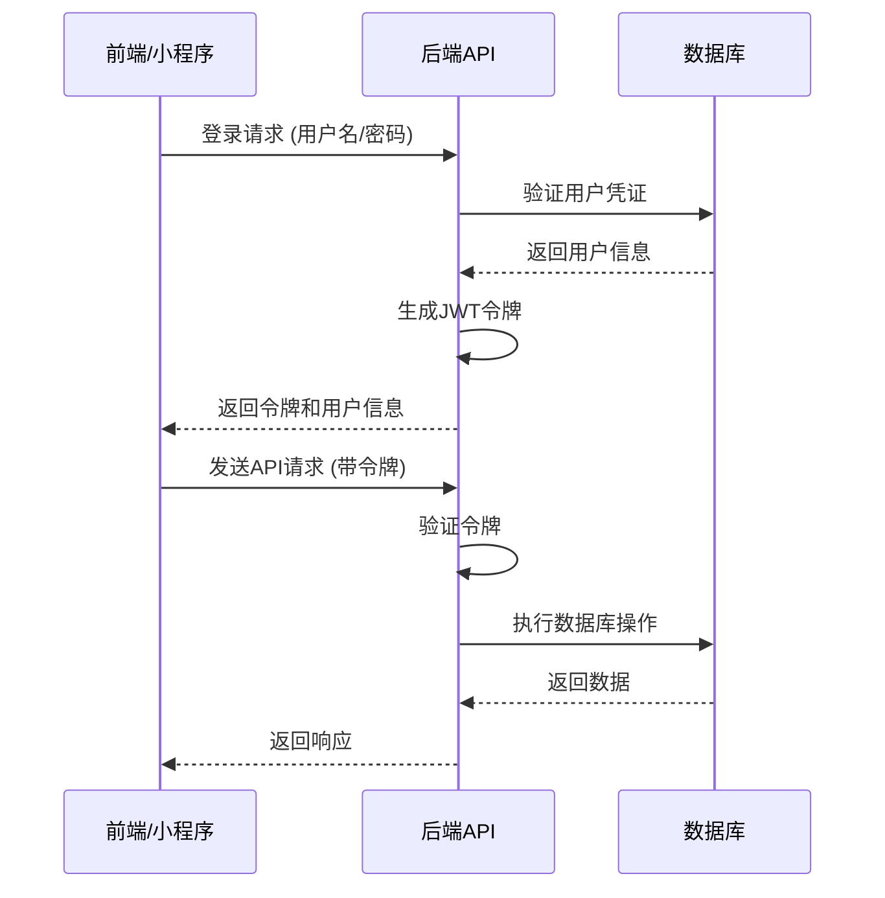

# 饮用水领用系统开发文档 v1.0.5 详细版

## 1. 项目概述

饮用水领用系统是一个用于管理饮用水的领用、送水和库存的完整系统。系统包含前端管理界面、后端API服务以及小程序端，实现了完整的饮用水管理流程，包括仓库管理、送水管理、领用管理、库存管理等核心功能。

### 1.1 系统功能

- **仓库管理**：添加、编辑、删除仓库，仓库名称与存放位置自动同步
- **饮用水品类管理**：添加、编辑、删除饮用水品类
- **送水管理**：添加送水记录，审批送水记录，管理送水流程
- **领用管理**：提交领用申请，查看领用记录，归还空桶
- **库存管理**：查看库存状态，设置库存预警阈值，批量清零库存
- **部门管理**：管理系统用户所属部门
- **用户管理**：添加、编辑、删除系统用户
- **系统日志**：记录系统操作日志
- **扫码登录**：通过扫描二维码实现角色登录和仓库信息获取
- **统计分析**：提供饮用水使用情况的统计分析
- **账单管理**：管理饮用水相关的账单和支付

## 2. 系统架构

### 2.1 技术栈

- **前端**：Vue 3 + Element Plus + Vite
- **后端**：Node.js + Express + Sequelize
- **数据库**：MySQL
- **小程序**：微信小程序、支付宝小程序
- **认证**：JWT 令牌认证
- **部署**：Docker 容器化部署

### 2.2 目录结构

```
water-node+vue/
├── backend/           # 后端服务
│   ├── config/        # 配置文件
│   ├── middleware/    # 中间件
│   ├── models/        # 数据模型
│   ├── routes/        # 路由
│   ├── services/      # 业务逻辑
│   ├── ssl/           # SSL 证书
│   └── app.js         # 入口文件
├── frontend/          # 前端应用
│   ├── public/        # 静态资源
│   ├── src/           # 源码
│   │   ├── assets/    # 资源文件
│   │   ├── components/ # 组件
│   │   ├── router/    # 路由
│   │   ├── utils/     # 工具类
│   │   ├── views/     # 页面
│   │   ├── App.vue    # 根组件
│   │   └── main.js    # 入口文件
│   ├── ssl/           # SSL 证书
│   └── index.html     # HTML模板
├── water-mini-app/    # 微信小程序
├── water-alipay-mini-app/ # 支付宝小程序
└── ssl/               # 系统级 SSL 证书
```

### 2.3 系统流程图



## 3. 核心功能模块

### 3.1 仓库管理

- **功能**：管理仓库信息，包括仓库名称、位置、联系人等
- **特点**：
  - 仓库名称修改时，存放位置会自动同步更新
  - 仓库删除时，会检查库存是否为0，只有库存为0时才允许删除
  - 库存管理中显示的仓库名称会自动关联仓库管理中的设置
- **流程**：
  1. 管理员登录系统
  2. 进入系统设置 -> 仓库管理
  3. 添加、编辑或删除仓库
  4. 系统自动更新相关数据

### 3.2 送水管理

- **功能**：管理送水记录，包括送水日期、数量、空桶数量等
- **特点**：
  - 送水记录需要审批（管理员可以直接审批）
  - 审批通过后会自动更新库存
  - 送水日期格式自动处理，确保数据正确性
- **流程**：
  1. 送水员或管理员添加送水记录
  2. 管理员审批送水记录
  3. 审批通过后，系统自动更新库存
  4. 记录送水操作日志

### 3.3 领用管理

- **功能**：管理饮用水领用记录
- **特点**：
  - 领用记录关联仓库名称，直接显示仓库名称而非ID
  - 自动检查库存是否足够
  - 支持归还空桶
  - 可通过小程序扫码提交领用申请
- **流程**：
  1. 用户提交领用申请（可通过小程序扫码）
  2. 系统检查库存是否足够
  3. 生成领用记录
  4. 自动更新库存

### 3.4 库存管理

- **功能**：管理饮用水库存，设置预警阈值
- **特点**：
  - 库存显示关联仓库名称，而非静态位置
  - 库存预警功能，当库存低于阈值时显示预警
  - 支持批量清零库存
- **流程**：
  1. 管理员查看库存状态
  2. 设置库存预警阈值
  3. 系统自动监控库存状态
  4. 当库存低于阈值时，系统发出预警

### 3.5 扫码登录模块

- **功能**：通过扫描二维码实现角色登录和仓库信息获取
- **特点**：
  - 支持不同角色（管理员、送水员、普通用户）的扫码登录
  - 扫码时自动获取仓库信息
  - 生成包含角色、用户和仓库信息的二维码
- **流程**：
  1. 系统生成包含角色和仓库信息的二维码
  2. 用户使用小程序扫描二维码
  3. 系统验证二维码信息
  4. 自动登录并跳转到相应功能页面

### 3.6 统计分析

- **功能**：提供饮用水使用情况的统计分析
- **特点**：
  - 支持按时间段、仓库、部门等维度进行统计
  - 提供可视化图表展示
  - 导出统计报表
- **流程**：
  1. 管理员进入统计分析页面
  2. 设置统计参数
  3. 系统生成统计数据和图表
  4. 可选择导出报表

## 4. 数据库结构

### 4.1 主要表结构

#### warehouse（仓库表）
| 字段名 | 数据类型 | 描述 |
|-------|---------|------|
| id | BIGINT UNSIGNED | 仓库ID |
| name | VARCHAR(100) | 仓库名称 |
| location | VARCHAR(255) | 存放位置 |
| contactPerson | VARCHAR(50) | 联系人 |
| contactPhone | VARCHAR(20) | 联系电话 |
| description | TEXT | 仓库描述 |
| createdAt | DATE | 创建时间 |
| updatedAt | DATE | 更新时间 |

#### water_category（饮用水品类表）
| 字段名 | 数据类型 | 描述 |
|-------|---------|------|
| id | BIGINT UNSIGNED | 品类ID |
| name | VARCHAR(100) | 品类名称 |
| unit | VARCHAR(20) | 单位 |
| price | DECIMAL(10,2) | 价格 |
| capacity | DECIMAL(10,2) | 容量 |
| createdAt | DATE | 创建时间 |
| updatedAt | DATE | 更新时间 |

#### inventory（库存表）
| 字段名 | 数据类型 | 描述 |
|-------|---------|------|
| id | BIGINT UNSIGNED | 库存ID |
| waterCategoryId | BIGINT UNSIGNED | 饮用水品类ID |
| warehouseId | BIGINT UNSIGNED | 仓库ID |
| quantity | INTEGER | 数量 |
| emptyBucketQuantity | INTEGER | 空桶数量 |
| location | VARCHAR(100) | 存放位置 |
| status | TINYINT | 状态 |
| alertThreshold | INTEGER | 预警阈值 |
| createdAt | DATE | 创建时间 |
| updatedAt | DATE | 更新时间 |

#### delivery_record（送水记录表）
| 字段名 | 数据类型 | 描述 |
|-------|---------|------|
| id | BIGINT UNSIGNED | 记录ID |
| waterCategoryId | BIGINT UNSIGNED | 饮用水品类ID |
| warehouseId | BIGINT UNSIGNED | 仓库ID |
| quantity | INTEGER | 数量 |
| emptyBucketQuantity | INTEGER | 领取空桶数量 |
| date | DATEONLY | 送水日期 |
| remark | VARCHAR(200) | 备注 |
| status | ENUM | 状态 |
| createdAt | DATE | 创建时间 |
| updatedAt | DATE | 更新时间 |

#### consumption（领用记录表）
| 字段名 | 数据类型 | 描述 |
|-------|---------|------|
| id | BIGINT UNSIGNED | 领用记录ID |
| waterCategoryId | BIGINT UNSIGNED | 饮用水品类ID |
| warehouseId | BIGINT UNSIGNED | 领用仓库ID |
| departmentId | BIGINT UNSIGNED | 领用部门ID |
| receiver | VARCHAR(50) | 领用人 |
| quantity | INTEGER | 领用数量 |
| returnEmptyBottles | INTEGER | 归还空桶数量 |
| consumptionDate | DATE | 领用时间 |
| notes | TEXT | 备注 |
| status | VARCHAR(20) | 状态 |
| createdAt | DATE | 创建时间 |
| updatedAt | DATE | 更新时间 |

#### department（部门表）
| 字段名 | 数据类型 | 描述 |
|-------|---------|------|
| id | BIGINT UNSIGNED | 部门ID |
| name | VARCHAR(100) | 部门名称 |
| createdAt | DATE | 创建时间 |
| updatedAt | DATE | 更新时间 |

#### user（用户表）
| 字段名 | 数据类型 | 描述 |
|-------|---------|------|
| id | BIGINT UNSIGNED | 用户ID |
| username | VARCHAR(50) | 用户名 |
| password | VARCHAR(255) | 密码 |
| name | VARCHAR(50) | 姓名 |
| email | VARCHAR(100) | 邮箱 |
| phone | VARCHAR(20) | 电话 |
| departmentId | BIGINT UNSIGNED | 部门ID |
| role | VARCHAR(20) | 角色 |
| status | TINYINT | 状态 |
| createdAt | DATE | 创建时间 |
| updatedAt | DATE | 更新时间 |

#### system_log（系统日志表）
| 字段名 | 数据类型 | 描述 |
|-------|---------|------|
| id | BIGINT UNSIGNED | 日志ID |
| userId | BIGINT UNSIGNED | 用户ID |
| action | VARCHAR(100) | 操作类型 |
| description | TEXT | 操作描述 |
| ip | VARCHAR(50) | 操作IP |
| createdAt | DATE | 创建时间 |

#### bill（账单表）
| 字段名 | 数据类型 | 描述 |
|-------|---------|------|
| id | BIGINT UNSIGNED | 账单ID |
| billNo | VARCHAR(50) | 账单编号 |
| startDate | DATE | 开始日期 |
| endDate | DATE | 结束日期 |
| totalAmount | DECIMAL(10,2) | 总金额 |
| status | VARCHAR(20) | 状态 |
| paymentMethod | VARCHAR(50) | 支付方式 |
| paidAt | DATE | 支付时间 |
| createdAt | DATE | 创建时间 |
| updatedAt | DATE | 更新时间 |

## 5. API 接口

### 5.1 认证接口

| 方法 | 路径 | 功能 |
|-----|------|------|
| POST | /api/auth/login | 用户登录 |
| POST | /api/auth/logout | 用户登出 |
| GET | /api/auth/me | 获取当前用户信息 |
| POST | /api/mini-app/login | 小程序登录 |
| POST | /api/mini-app/scan-login | 扫码登录 |

### 5.2 仓库管理接口

| 方法 | 路径 | 功能 |
|-----|------|------|
| GET | /api/system/warehouse | 获取所有仓库 |
| GET | /api/system/warehouse/:id | 获取单个仓库 |
| POST | /api/system/warehouse | 创建仓库 |
| PUT | /api/system/warehouse/:id | 更新仓库 |
| DELETE | /api/system/warehouse/:id | 删除仓库 |

### 5.3 送水管理接口

| 方法 | 路径 | 功能 |
|-----|------|------|
| POST | /api/delivery | 添加送水记录 |
| GET | /api/delivery | 获取送水记录列表 |
| GET | /api/delivery/:id | 获取送水记录详情 |
| PUT | /api/delivery/:id | 更新送水记录 |
| DELETE | /api/delivery/:id | 删除送水记录 |
| PUT | /api/delivery/:id/approve | 审批送水记录 |
| POST | /api/delivery/category | 添加饮用水品类 |
| GET | /api/delivery/category | 获取饮用水品类列表 |
| PUT | /api/delivery/category/:id | 更新饮用水品类 |
| DELETE | /api/delivery/category/:id | 删除饮用水品类 |

### 5.4 领用管理接口

| 方法 | 路径 | 功能 |
|-----|------|------|
| POST | /api/consumption | 提交领用申请 |
| GET | /api/consumption | 获取领用记录列表 |
| GET | /api/consumption/:id | 获取领用记录详情 |
| GET | /api/consumption/category | 获取饮用水品类列表 |
| GET | /api/consumption/warehouse | 获取仓库列表 |
| GET | /api/consumption/department | 获取部门列表 |

### 5.5 库存管理接口

| 方法 | 路径 | 功能 |
|-----|------|------|
| GET | /api/inventory | 获取库存列表 |
| GET | /api/inventory/alert | 获取库存预警 |
| PUT | /api/inventory/:id | 更新库存信息 |
| POST | /api/inventory/clear | 批量清零库存 |

### 5.6 系统管理接口

| 方法 | 路径 | 功能 |
|-----|------|------|
| GET | /api/system/department | 获取部门列表 |
| POST | /api/system/department | 创建部门 |
| PUT | /api/system/department/:id | 更新部门 |
| DELETE | /api/system/department/:id | 删除部门 |
| GET | /api/system/user | 获取用户列表 |
| POST | /api/system/user | 创建用户 |
| PUT | /api/system/user/:id | 更新用户 |
| DELETE | /api/system/user/:id | 删除用户 |
| GET | /api/system/log | 获取系统日志 |

### 5.7 统计接口

| 方法 | 路径 | 功能 |
|-----|------|------|
| GET | /api/statistics/consumption | 获取领用统计 |
| GET | /api/statistics/delivery | 获取送水统计 |
| GET | /api/statistics/inventory | 获取库存统计 |
| GET | /api/statistics/department | 获取部门统计 |

### 5.8 账单接口

| 方法 | 路径 | 功能 |
|-----|------|------|
| GET | /api/billing | 获取账单列表 |
| POST | /api/billing | 创建账单 |
| GET | /api/billing/:id | 获取账单详情 |
| PUT | /api/billing/:id | 更新账单 |
| DELETE | /api/billing/:id | 删除账单 |

## 6. 小程序功能

### 6.1 微信小程序

- **功能**：
  - 扫码登录
  - 提交领用申请
  - 查看送水记录
  - 查看个人领用记录
- **页面**：
  - login：登录页面
  - consumption：领用页面
  - delivery：送水记录页面
  - success：操作成功页面

### 6.2 支付宝小程序

- **功能**：
  - 扫码登录
  - 提交领用申请
  - 查看送水记录
- **页面**：
  - account-login：登录页面
  - consumption：领用页面
  - delivery：送水记录页面
  - success：操作成功页面

## 7. 系统改进方向

### 7.1 性能优化

1. **数据库优化**：
   - 添加索引优化查询速度
   - 优化数据库连接池配置
   - 实现数据库读写分离

2. **前端优化**：
   - 组件懒加载
   - 图片资源优化
   - 缓存策略优化

3. **后端优化**：
   - API响应时间优化
   - 批量操作优化
   - 内存使用优化

### 7.2 安全性增强

1. **认证安全**：
   - 实现双因素认证
   - 密码强度要求
   - 登录失败次数限制

2. **数据安全**：
   - 敏感数据加密存储
   - 数据传输加密
   - 定期数据备份

3. **权限控制**：
   - 更细粒度的权限管理
   - 操作审计日志
   - 权限变更通知

### 7.3 功能扩展

1. **移动端APP**：
   - 开发原生iOS/Android应用
   - 支持离线操作
   - 推送通知功能

2. **数据分析**：
   - 更丰富的统计图表
   - 预测分析功能
   - 自定义报表生成

3. **系统集成**：
   - 与企业ERP系统集成
   - 与财务系统集成
   - 与物联网设备集成（如智能水表）

### 7.4 用户体验

1. **界面优化**：
   - 响应式设计
   - 深色模式支持
   - 个性化主题

2. **交互优化**：
   - 操作流程简化
   - 批量操作支持
   - 智能表单填充

3. **辅助功能**：
   - 语音操作支持
   - 多语言支持
   - 无障碍访问支持

### 7.5 运维管理

1. **监控系统**：
   - 服务器性能监控
   - 系统运行状态监控
   - 异常告警机制

2. **自动化部署**：
   - CI/CD流程优化
   - 自动化测试
   - 灰度发布支持

3. **文档完善**：
   - API文档自动生成
   - 操作手册更新
   - 技术架构文档完善

## 8. 部署说明

### 8.1 后端部署

1. **环境要求**：
   - Node.js v14+
   - MySQL 5.7+
   - 操作系统：Linux/Windows

2. **部署步骤**：
   - 安装依赖：`npm install`
   - 配置环境变量（.env文件）
   - 初始化数据库：`INIT_DB=true node app.js`
   - 启动服务：`node app.js`

3. **Docker部署**：
   ```bash
   docker-compose up -d
   ```

### 8.2 前端部署

1. **环境要求**：
   - Node.js v14+
   - 构建工具：Vite

2. **部署步骤**：
   - 安装依赖：`npm install`
   - 构建生产版本：`npm run build`
   - 部署dist目录到web服务器

### 8.3 小程序部署

1. **微信小程序**：
   - 在微信开发者工具中导入项目
   - 配置AppID
   - 上传代码并发布

2. **支付宝小程序**：
   - 在支付宝开发者工具中导入项目
   - 配置AppID
   - 上传代码并发布

## 9. 系统使用说明

### 9.1 管理员操作

1. **登录系统**：使用管理员账号登录
2. **系统设置**：
   - 仓库管理：添加和管理仓库
   - 部门管理：添加和管理部门
   - 用户管理：添加和管理用户
3. **送水管理**：
   - 添加送水记录
   - 审批送水记录
   - 管理饮用水品类
4. **库存管理**：
   - 查看库存状态
   - 设置库存预警阈值
   - 批量清零库存
5. **统计分析**：
   - 查看各项统计数据
   - 导出统计报表

### 9.2 送水员操作

1. **登录系统**：使用送水员账号登录或扫码登录
2. **送水管理**：
   - 添加送水记录
   - 查看送水记录状态
3. **库存查看**：查看负责仓库的库存状态

### 9.3 普通用户操作

1. **登录系统**：使用普通用户账号登录或扫码登录
2. **领用管理**：
   - 提交领用申请
   - 查看个人领用记录
   - 归还空桶
3. **小程序操作**：
   - 扫码登录
   - 提交领用申请
   - 查看领用记录

## 10. 注意事项

1. **数据安全**：
   - 定期备份数据库
   - 敏感操作需要权限验证
   - 操作日志记录完整

2. **系统维护**：
   - 定期检查库存预警
   - 及时处理送水记录审批
   - 定期清理系统日志

3. **使用规范**：
   - 仓库删除前请确保库存为0
   - 送水记录需要审批后才会更新库存
   - 领用记录会自动检查库存是否足够
   - 扫码登录时请确保二维码的安全性

4. **故障处理**：
   - 数据库连接失败：检查数据库服务状态
   - 系统登录失败：检查用户名密码和网络连接
   - 库存更新失败：检查库存数据和操作权限

---

**文档版本**：v1.0.5 详细版
**更新日期**：2026-03-01
**开发团队**：饮用水领用系统开发组
**联系邮箱**：support@water-system.com
