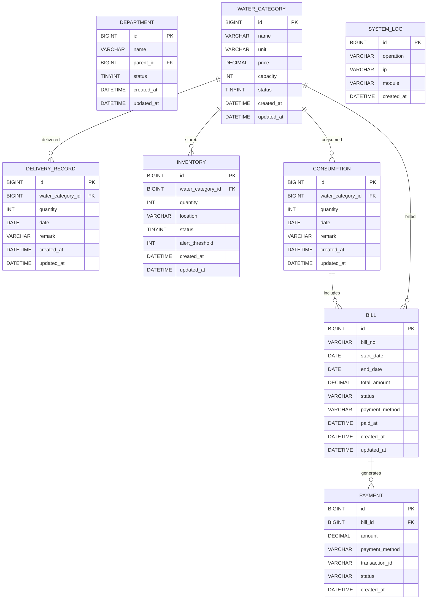

# 饮用水领用系统开发文档（简化版）

## 1. 系统概述

### 1.1 系统简介

饮用水领用系统是一个用于管理企业内部饮用水配送、领用和库存的综合管理系统。系统通过后端API和前端网页两个部分，实现了从送水记录、库存管理到领用统计的全流程管理，帮助企业提高饮用水管理效率，减少资源浪费。

### 1.2 核心功能

- **送水记录管理**：记录送水信息、饮用水品类管理、送水统计
- **库存管理**：仓库区域管理、添加应用水品类管理（价格、类型、单位）、库存查询、库存预警
- **领用管理**：领用申请（领用需要填写部门，领用人姓名、领取的仓库、领取饮用水类型、数量、时间不需要填写取当前时间）、领用记录
- **结算管理**：费用计算、账单生成、支付管理
- **统计分析**：数据报表、趋势分析、数据导出
- **系统管理**：配置管理、日志管理、数据备份

### 1.3 技术栈选择

| 分类      | 技术/框架           | 版本     | 选型理由               |
| ------- | --------------- | ------ | ------------------ |
| **后端**  | Node.js         | 18.x+  | 异步非阻塞、高性能、生态丰富     |
|         | Express         | 4.x    | 轻量高效、路由系统强大、中间件丰富 |
|         | Sequelize       | 6.x    | 支持多种数据库、ORM功能完善、类型安全 |
|         | MySQL           | 8.0    | 稳定可靠、适合中小型应用、社区活跃  |
| **前端**  | Vue.js          | 3.x    | 响应式数据绑定、组件化开发、生态丰富 |
|         | Element Plus    | 2.x    | 美观易用、功能丰富、文档完善     |
|         | Axios           | 1.x    | 简洁易用、支持拦截器、跨域处理    |
|         | ECharts         | 5.x    | 强大的图表功能、支持多种图表类型   |

### 1.4 设计目标

- **功能完整**：覆盖饮用水管理全流程，满足企业内部管理需求
- **易用性**：界面友好，操作简单，降低用户学习成本
- **可靠性**：系统稳定运行，数据安全可靠
- **可扩展性**：模块化设计，便于后续功能扩展和技术升级
- **成本可控**：适合并发数≤100的场景，部署成本低

## 2. 系统架构设计

### 2.1 整体架构

系统采用**分层架构**设计，分为前端层、后端服务层和数据存储层三个核心部分。前端层负责用户界面展示，后端服务层处理业务逻辑，数据存储层负责数据持久化。

```mermaid
flowchart TD
    subgraph 前端层
        Web[前端网页
Vue.js 3.x + Element Plus]
    end

    subgraph 后端服务层
        API[后端API服务
Node.js + Express 4.x]
        Service[业务服务层
Services]
        Model[数据访问层
Sequelize ORM]
    end

    subgraph 数据存储层
        MySQL[MySQL 8.0
关系型数据库]dockers部署
    end

    Web -->|HTTP请求| API
    API -->|调用| Service
    Service -->|操作数据| Model
    Model -->|读写| MySQL
```

### 2.2 核心模块关系

| 模块名称       | 主要职责           | 依赖模块           | 被依赖模块  |
| ---------- | -------------- | -------------- | ------ |
| **送水管理模块** | 送水记录、饮用水品类管理   | 饮用水品类实体        | 库存管理模块 |
| **库存管理模块** | 库存查询、预警管理      | 饮用水品类实体、送水记录实体 | 领用管理模块 |
| **领用管理模块** | 领用申请、领用记录      | 饮用水品类实体   | 结算管理模块 |
| **结算管理模块** | 费用计算、账单生成、支付管理 | 领用记录实体、饮用水品类实体 | 统计分析模块 |
| **统计分析模块** | 数据报表、趋势分析      | 所有业务实体         | 无      |
| **系统管理模块** | 配置管理、日志管理      | 无           | 无      |

### 2.3 数据流设计

1. **送水流程**：提交送水记录 → 后端保存记录 → 更新库存 → 记录系统日志
2. **领用流程**：用户选择饮用水品类 → 提交领用申请 → 后端保存申请 → 更新库存 → 记录系统日志
3. **结算流程**：系统汇总领用记录 → 计算费用 → 生成账单 → 完成支付 → 记录系统日志
4. **库存预警流程**：系统定期检查库存 → 发现低于预警值 → 发送预警通知 → 管理员安排送水
5. **统计分析流程**：发起统计请求 → 后端查询数据 → 生成报表 → 展示或导出

## 3. 功能模块详细设计

### 3.1 后端API模块

#### 3.1.1 送水管理模块（DeliveryController）

| 功能            | API路径                         | 方法     | 请求体（JSON）                                                                          | 响应（JSON）                                              |
| ------------- | ----------------------------- | ------ | ---------------------------------------------------------------------------------- | ----------------------------------------------------- |
| **添加送水记录**    | `/api/delivery`               | POST   | `{"water_category_id": 1, "quantity": 50, "date": "2024-02-14", "remark": "月度送水"}` | `{"code": 200, "data": {"id": 1}, "message": "添加成功"}` |
| **获取送水记录列表**  | `/api/delivery`               | GET    | N/A                                                                                | `{"code": 200, "data": [...], "message": "获取成功"}`     |
| **获取送水记录详情**  | `/api/delivery/{id}`          | GET    | N/A                                                                                | `{"code": 200, "data": {...}, "message": "获取成功"}`     |
| **更新送水记录**    | `/api/delivery/{id}`          | PUT    | `{"quantity": 60, "remark": "调整数量"}`                                               | `{"code": 200, "data": null, "message": "更新成功"}`      |
| **删除送水记录**    | `/api/delivery/{id}`          | DELETE | N/A                                                                                | `{"code": 200, "data": null, "message": "删除成功"}`      |
| **添加饮用水品类**   | `/api/delivery/category`      | POST   | `{"name": "桶装水", "unit": "桶", "price": 15.00, "capacity": 18.9}`                   | `{"code": 200, "data": {"id": 1}, "message": "添加成功"}` |
| **获取饮用水品类列表** | `/api/delivery/category`      | GET    | N/A                                                                                | `{"code": 200, "data": [...], "message": "获取成功"}`     |
| **更新饮用水品类**   | `/api/delivery/category/{id}` | PUT    | `{"name": "桶装水", "unit": "桶", "price": 16.00, "capacity": 18.9}`                   | `{"code": 200, "data": null, "message": "更新成功"}`      |
| **删除饮用水品类**   | `/api/delivery/category/{id}` | DELETE | N/A                                                                                | `{"code": 200, "data": null, "message": "删除成功"}`      |

#### 3.1.2 库存管理模块（InventoryController）

| 功能            | API路径                     | 方法  | 请求体（JSON）                                                                             | 响应（JSON）                                          |
| ------------- | ------------------------- | --- | ------------------------------------------------------------------------------------- | ------------------------------------------------- |
| **获取库存列表**    | `/api/inventory`          | GET | N/A                                                                                   | `{"code": 200, "data": [...], "message": "获取成功"}` |
| **获取库存详情**    | `/api/inventory/{id}`     | GET | N/A                                                                                   | `{"code": 200, "data": {...}, "message": "获取成功"}` |
| **更新库存信息**    | `/api/inventory/{id}`     | PUT | `{"water_category_id": 1, "quantity": 100, "location": "仓库A", "alert_threshold": 15}` | `{"code": 200, "data": null, "message": "更新成功"}`  |
| **获取库存预警**    | `/api/inventory/alert`    | GET | N/A                                                                                   | `{"code": 200, "data": [...], "message": "获取成功"}` |
| **获取饮用水品类列表** | `/api/inventory/category` | GET | N/A                                                                                   | `{"code": 200, "data": [...], "message": "获取成功"}` |

#### 3.1.3 领用管理模块（ConsumptionController）

| 功能            | API路径                       | 方法   | 请求体（JSON）                                                                         | 响应（JSON）                                              |
| ------------- | --------------------------- | ---- | --------------------------------------------------------------------------------- | ----------------------------------------------------- |
| **提交领用申请**    | `/api/consumption`          | POST | `{"water_category_id": 1, "quantity": 5, "date": "2024-02-14", "remark": "部门领用"}` | `{"code": 200, "data": {"id": 1}, "message": "申请成功"}` |
| **获取领用记录列表**  | `/api/consumption`          | GET  | N/A                                                                               | `{"code": 200, "data": [...], "message": "获取成功"}`     |
| **获取领用记录详情**  | `/api/consumption/{id}`     | GET  | N/A                                                                               | `{"code": 200, "data": {...}, "message": "获取成功"}`     |
| **获取饮用水品类列表** | `/api/consumption/category` | GET  | N/A                                                                               | `{"code": 200, "data": [...], "message": "获取成功"}`     |

#### 3.1.4 结算管理模块（BillingController）

| 功能         | API路径                    | 方法   | 请求体（JSON）                                                | 响应（JSON）                                                            |
| ---------- | ------------------------ | ---- | -------------------------------------------------------- | ------------------------------------------------------------------- |
| **生成账单**   | `/api/billing/generate`  | POST | `{"start_date": "2024-01-01", "end_date": "2024-01-31"}` | `{"code": 200, "data": {"bill_id": 1}, "message": "生成成功"}`          |
| **获取账单列表** | `/api/billing`           | GET  | N/A                                                      | `{"code": 200, "data": [...], "message": "获取成功"}`                   |
| **获取账单详情** | `/api/billing/{id}`      | GET  | N/A                                                      | `{"code": 200, "data": {...}, "message": "获取成功"}`                   |
| **支付账单**   | `/api/billing/pay/{id}`  | PUT  | `{"payment_method": "微信支付", "amount": 100.00}`           | `{"code": 200, "data": null, "message": "支付成功"}`                    |
| **费用计算**   | `/api/billing/calculate` | POST | `{"water_category_id": 1, "quantity": 5}`                | `{"code": 200, "data": {"total_amount": 75.00}, "message": "计算成功"}` |

#### 3.1.5 统计分析模块（StatisticsController）

| 功能         | API路径                         | 方法  | 请求体（JSON） | 响应（JSON）                                          |
| ---------- | ----------------------------- | --- | --------- | ------------------------------------------------- |
| **获取送水统计** | `/api/statistics/delivery`    | GET | N/A       | `{"code": 200, "data": {...}, "message": "获取成功"}` |
| **获取领用统计** | `/api/statistics/consumption` | GET | N/A       | `{"code": 200, "data": {...}, "message": "获取成功"}` |
| **获取库存统计** | `/api/statistics/inventory`   | GET | N/A       | `{"code": 200, "data": {...}, "message": "获取成功"}` |
| **获取结算统计** | `/api/statistics/billing`     | GET | N/A       | `{"code": 200, "data": {...}, "message": "获取成功"}` |
| **导出统计数据** | `/api/statistics/export`      | GET | N/A       | 文件流                                               |

#### 3.1.6 系统管理模块（SystemController）

| 功能         | API路径                   | 方法     | 请求体（JSON）                                                                                       | 响应（JSON）                                              |
| ---------- | ----------------------- | ------ | ----------------------------------------------------------------------------------------------- | ----------------------------------------------------- |
| **获取系统日志** | `/api/system/log`       | GET    | N/A                                                                                             | `{"code": 200, "data": [...], "message": "获取成功"}`     |

### 3.2 前端网页模块

#### 3.2.1 核心页面

| 页面名称     | 路径             | 主要功能              |
| -------- | -------------- | ----------------- |
| **首页**   | `/`            | 系统概览、快速操作、通知      |
| **送水管理** | `/delivery`    | 送水记录、饮用水品类管理、送水统计 |
| **库存管理** | `/inventory`   | 饮用水品类管理、库存查询、预警设置 |
| **领用管理** | `/consumption` | 领用申请、记录查询、饮用水品类选择 |
| **结算管理** | `/billing`     | 费用计算、账单生成、支付管理    |
| **统计分析** | `/statistics`  | 数据报表、趋势分析、导出      |
| **系统设置** | `/system`      | 配置管理、日志管理      |

#### 3.2.2 技术实现

- **前端框架**：Vue.js 3.x + Vite
- **UI组件库**：Element Plus
- **状态管理**：Pinia
- **路由管理**：Vue Router
- **HTTP请求**：Axios
- **数据可视化**：ECharts
- **样式预处理**：SCSS

## 4. 数据模型设计

### 4.1 核心实体关系



### 4.2 数据库表结构

#### 4.2.1 部门表（department）

```sql
CREATE TABLE `department` (
  `id` BIGINT UNSIGNED NOT NULL AUTO_INCREMENT COMMENT '部门ID',
  `name` VARCHAR(50) NOT NULL COMMENT '部门名称',
  `parent_id` BIGINT UNSIGNED DEFAULT NULL COMMENT '父部门ID',
  `status` TINYINT DEFAULT 1 COMMENT '状态：1-启用，0-禁用',
  `created_at` DATETIME DEFAULT CURRENT_TIMESTAMP COMMENT '创建时间',
  `updated_at` DATETIME DEFAULT CURRENT_TIMESTAMP ON UPDATE CURRENT_TIMESTAMP COMMENT '更新时间',
  PRIMARY KEY (`id`),
  KEY `idx_parent_id` (`parent_id`)
) ENGINE=InnoDB DEFAULT CHARSET=utf8mb4 COMMENT='部门信息表';
```

#### 4.2.2 饮用水品类表（water_category）

```sql
CREATE TABLE `water_category` (
  `id` BIGINT UNSIGNED NOT NULL AUTO_INCREMENT COMMENT '饮用水品类ID',
  `name` VARCHAR(50) NOT NULL COMMENT '品类名称',
  `unit` VARCHAR(10) NOT NULL COMMENT '单位：桶、件',
  `price` DECIMAL(10,2) NOT NULL COMMENT '单价',
  `capacity` INT NOT NULL COMMENT '容量（升）',
  `status` TINYINT DEFAULT 1 COMMENT '状态：1-启用，0-禁用',
  `created_at` DATETIME DEFAULT CURRENT_TIMESTAMP COMMENT '创建时间',
  `updated_at` DATETIME DEFAULT CURRENT_TIMESTAMP ON UPDATE CURRENT_TIMESTAMP COMMENT '更新时间',
  PRIMARY KEY (`id`)
) ENGINE=InnoDB DEFAULT CHARSET=utf8mb4 COMMENT='饮用水品类表';
```

#### 4.2.3 送水记录表（delivery_record）

```sql
CREATE TABLE `delivery_record` (
  `id` BIGINT UNSIGNED NOT NULL AUTO_INCREMENT COMMENT '记录ID',
  `water_category_id` BIGINT UNSIGNED NOT NULL COMMENT '饮用水品类ID',
  `quantity` INT NOT NULL COMMENT '数量',
  `date` DATE NOT NULL COMMENT '送水日期',
  `remark` VARCHAR(200) DEFAULT NULL COMMENT '备注',
  `created_at` DATETIME DEFAULT CURRENT_TIMESTAMP COMMENT '创建时间',
  `updated_at` DATETIME DEFAULT CURRENT_TIMESTAMP ON UPDATE CURRENT_TIMESTAMP COMMENT '更新时间',
  PRIMARY KEY (`id`),
  KEY `idx_water_category_id` (`water_category_id`)
) ENGINE=InnoDB DEFAULT CHARSET=utf8mb4 COMMENT='送水记录表';
```

#### 4.2.4 库存表（inventory）

```sql
CREATE TABLE `inventory` (
  `id` BIGINT UNSIGNED NOT NULL AUTO_INCREMENT COMMENT '库存ID',
  `water_category_id` BIGINT UNSIGNED NOT NULL COMMENT '饮用水品类ID',
  `quantity` INT NOT NULL COMMENT '数量',
  `location` VARCHAR(100) DEFAULT NULL COMMENT '存放位置',
  `status` TINYINT DEFAULT 1 COMMENT '状态：1-正常，0-异常',
  `alert_threshold` INT DEFAULT 10 COMMENT '预警阈值',
  `created_at` DATETIME DEFAULT CURRENT_TIMESTAMP COMMENT '创建时间',
  `updated_at` DATETIME DEFAULT CURRENT_TIMESTAMP ON UPDATE CURRENT_TIMESTAMP COMMENT '更新时间',
  PRIMARY KEY (`id`),
  KEY `idx_water_category_id` (`water_category_id`)
) ENGINE=InnoDB DEFAULT CHARSET=utf8mb4 COMMENT='库存表';
```

#### 4.2.5 领用记录表（consumption）

```sql
CREATE TABLE `consumption` (
  `id` BIGINT UNSIGNED NOT NULL AUTO_INCREMENT COMMENT '记录ID',
  `water_category_id` BIGINT UNSIGNED NOT NULL COMMENT '饮用水品类ID',
  `quantity` INT NOT NULL COMMENT '数量',
  `date` DATE NOT NULL COMMENT '领用日期',
  `remark` VARCHAR(200) DEFAULT NULL COMMENT '备注',
  `created_at` DATETIME DEFAULT CURRENT_TIMESTAMP COMMENT '创建时间',
  `updated_at` DATETIME DEFAULT CURRENT_TIMESTAMP ON UPDATE CURRENT_TIMESTAMP COMMENT '更新时间',
  PRIMARY KEY (`id`),
  KEY `idx_water_category_id` (`water_category_id`)
) ENGINE=InnoDB DEFAULT CHARSET=utf8mb4 COMMENT='领用记录表';
```

#### 4.2.6 账单表（bill）

```sql
CREATE TABLE `bill` (
  `id` BIGINT UNSIGNED NOT NULL AUTO_INCREMENT COMMENT '账单ID',
  `bill_no` VARCHAR(30) NOT NULL COMMENT '账单编号',
  `start_date` DATE NOT NULL COMMENT '开始日期',
  `end_date` DATE NOT NULL COMMENT '结束日期',
  `total_amount` DECIMAL(10,2) NOT NULL COMMENT '总金额',
  `status` VARCHAR(20) NOT NULL COMMENT '状态：UNPAID-未支付，PAID-已支付，CANCELLED-已取消',
  `payment_method` VARCHAR(20) DEFAULT NULL COMMENT '支付方式',
  `paid_at` DATETIME DEFAULT NULL COMMENT '支付时间',
  `created_at` DATETIME DEFAULT CURRENT_TIMESTAMP COMMENT '创建时间',
  `updated_at` DATETIME DEFAULT CURRENT_TIMESTAMP ON UPDATE CURRENT_TIMESTAMP COMMENT '更新时间',
  PRIMARY KEY (`id`),
  UNIQUE KEY `uk_bill_no` (`bill_no`),
  KEY `idx_status` (`status`)
) ENGINE=InnoDB DEFAULT CHARSET=utf8mb4 COMMENT='账单表';
```

#### 4.2.7 支付记录表（payment）

```sql
CREATE TABLE `payment` (
  `id` BIGINT UNSIGNED NOT NULL AUTO_INCREMENT COMMENT '支付记录ID',
  `bill_id` BIGINT UNSIGNED NOT NULL COMMENT '账单ID',
  `amount` DECIMAL(10,2) NOT NULL COMMENT '支付金额',
  `payment_method` VARCHAR(20) NOT NULL COMMENT '支付方式',
  `transaction_id` VARCHAR(100) DEFAULT NULL COMMENT '交易编号',
  `status` VARCHAR(20) NOT NULL COMMENT '状态：SUCCESS-成功，FAILED-失败，PENDING-处理中',
  `created_at` DATETIME DEFAULT CURRENT_TIMESTAMP COMMENT '创建时间',
  PRIMARY KEY (`id`),
  KEY `idx_bill_id` (`bill_id`),
  KEY `idx_status` (`status`)
) ENGINE=InnoDB DEFAULT CHARSET=utf8mb4 COMMENT='支付记录表';
```

#### 4.2.8 系统日志表（system_log）

```sql
CREATE TABLE `system_log` (
  `id` BIGINT UNSIGNED NOT NULL AUTO_INCREMENT COMMENT '日志ID',
  `operation` VARCHAR(100) NOT NULL COMMENT '操作内容',
  `ip` VARCHAR(50) DEFAULT NULL COMMENT '操作IP',
  `module` VARCHAR(50) DEFAULT NULL COMMENT '操作模块',
  `created_at` DATETIME DEFAULT CURRENT_TIMESTAMP COMMENT '创建时间',
  PRIMARY KEY (`id`),
  KEY `idx_module` (`module`)
) ENGINE=InnoDB DEFAULT CHARSET=utf8mb4 COMMENT='系统日志表';
```

## 5. 部署方案

### 5.1 本地开发环境

1. **环境准备**：
   
   - Node.js 18.x+
   - npm 9.x+
   - MySQL 8.0+
   - Vue CLI 5+

2. **启动步骤**：
   
   - **后端**：在后端目录执行`npm install`安装依赖，然后执行`npm run dev`启动开发服务器
   - **前端**：在前端目录执行`npm install`安装依赖，然后执行`npm run dev`启动开发服务器

### 5.2 生产环境部署

#### 5.2.1 服务器配置建议

| 配置项     | 推荐值      | 说明              |
| ------- | -------- | --------------- |
| **CPU** | 2核及以上    | 满足基本业务逻辑处理需求    |
| **内存**  | 4GB及以上   | 保证应用稳定运行        |
| **存储**  | 50GB及以上  | 存储应用文件和数据库数据    |
| **带宽**  | 1Mbps及以上 | 满足≤100并发的网络传输需求 |

#### 5.2.2 后端部署

1. **打包应用**：在后端目录执行`npm install`安装依赖，然后执行`npm run build`（如果有构建脚本）或直接上传源码
2. **上传部署**：将后端代码或构建产物上传到服务器
3. **启动服务**：执行命令`npm start`或使用PM2管理进程：`pm2 start app.js --name water-system-backend`
4. **配置服务**（可选）：使用PM2设置开机自启：`pm2 startup`和`pm2 save`

#### 5.2.3 前端部署

1. **构建应用**：执行`npm run build`生成`dist`目录
2. **部署静态文件**：将`dist`目录上传到Nginx服务器的`html`目录
3. **配置Nginx**：修改Nginx配置文件，添加反向代理

```nginx
server {
    listen 80;
    server_name example.com;

    location / {
        root /usr/share/nginx/html/water-system;
        index index.html;
        try_files $uri $uri/ /index.html;
    }

    location /api {
        proxy_pass http://localhost:8080/api;
        proxy_set_header Host $host;
        proxy_set_header X-Real-IP $remote_addr;
        proxy_set_header X-Forwarded-For $proxy_add_x_forwarded_for;
    }
}
```

### 5.3 容器化部署（Docker）

#### 5.3.1 Docker Compose

```yaml
version: '3.8'
services:
  mysql:
    image: mysql:8.0
    environment:
      MYSQL_ROOT_PASSWORD: 123456
      MYSQL_DATABASE: water_system
    ports:
      - "3306:3306"
    volumes:
      - mysql-data:/var/lib/mysql
      - ./sql:/docker-entrypoint-initdb.d
    networks:
      - water-network

  backend:
    build: ./backend
    ports:
      - "8080:8080"
    depends_on:
      - mysql
    environment:
      DB_HOST: mysql
      DB_PORT: 3306
      DB_NAME: water_system
      DB_USER: root
      DB_PASSWORD: 123456
    networks:
      - water-network

  frontend:
    build: ./frontend
    ports:
      - "80:80"
    depends_on:
      - backend
    networks:
      - water-network

volumes:
  mysql-data:

networks:
  water-network:
    driver: bridge
```

## 6. 安全性设计

### 6.1 数据安全

- **SQL注入防护**：使用Sequelize ORM的参数化查询，避免SQL注入攻击
- **XSS防护**：对用户输入进行过滤和转义，防止跨站脚本攻击
- **数据备份**：定期对数据库进行备份，防止数据丢失

### 6.2 网络安全

- **HTTPS**：在生产环境中使用SSL/TLS加密传输数据，防止数据窃听
- **API限流**：实现API接口限流，防止恶意请求导致系统崩溃
- **日志审计**：记录所有关键操作，便于安全审计和问题追溯

## 7. 性能优化

### 7.1 数据库优化

- **索引优化**：为频繁查询的字段创建索引，提高查询性能
- **SQL优化**：优化SQL语句，避免全表扫描和复杂关联查询
- **批量操作**：对于批量数据操作，使用批量插入和更新，减少数据库交互次数

### 7.2 应用优化

- **缓存机制**：对于热点数据，使用内存缓存，减少数据库查询
- **异步处理**：对于耗时操作，使用异步处理，提高系统响应速度
- **代码优化**：优化代码结构，减少不必要的计算和资源消耗

### 7.3 部署优化

- **服务器配置**：根据系统负载调整服务器配置，确保系统稳定运行
- **负载均衡**：在高并发场景下，使用负载均衡分发请求
- **监控告警**：配置系统监控，及时发现和解决性能问题

## 8. 后续规划

### 8.1 功能扩展

- **移动端APP**：开发Android/iOS原生APP，提供更丰富的功能
- **智能硬件集成**：集成智能水表、物联网设备，实现自动抄表和监控
- **数据分析增强**：引入机器学习算法，预测用水需求和优化库存管理
- **多语言支持**：增加多语言版本，支持国际化部署

### 8.2 技术升级

- **微服务架构**：当系统规模扩大时，拆分为微服务架构，提高系统弹性
- **云原生部署**：迁移到云平台，使用容器编排和自动伸缩
- **数据库分片**：当数据量增大时，采用数据库分片策略，提高存储和查询性能
- **API网关**：引入API网关，统一管理API请求，提供更丰富的安全和监控功能

### 8.3 运维改进

- **自动化部署**：实现CI/CD流程，自动化测试和部署
- **监控系统**：部署专业监控系统，实时监控系统运行状态
- **故障自愈**：实现故障自动检测和恢复机制，提高系统可用性
- **文档完善**：持续完善系统文档，包括API文档、用户手册和运维手册

## 9. 结论

本开发文档基于Node.js + Express + Sequelize + MySQL技术栈，为饮用水领用系统提供了完整的架构设计方案。通过模块化设计、RESTful API规范和安全措施，确保系统的可靠性、安全性和可维护性。

系统采用分层架构，分为前端层、后端服务层和数据存储层，核心功能包括送水管理、库存管理、领用管理、统计分析等，满足企业内部饮用水管理的全流程需求。

在部署方面，系统支持本地开发环境、生产环境部署和容器化部署多种方式，适合并发数≤100的场景，部署成本低，维护简单。

后续可通过功能扩展、技术升级和运维改进，持续提升系统性能和用户体验，满足企业不断发展的管理需求。
